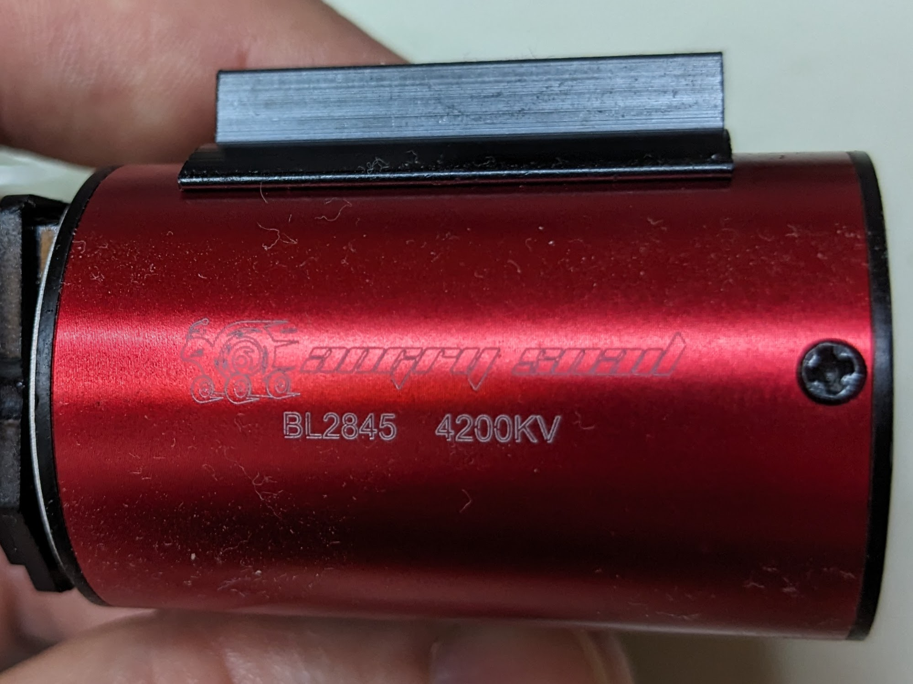

README
======

---

I was looking for some three-way splitter to split off power from the battery cabling to the Pi or Nano SBC to achieve something like the Holybro PM02:

<https://holybro.com/collections/power-modules-pdbs/products/pm02-v3-12s-power-module>

Note: this outputs 3.2A at 5.2V - way too little for what I want.

But I think the end the simplest is a screw terminal block like this:

<https://uk.rs-online.com/web/p/standard-terminal-blocks/8407951>

Note: 36A seems to be the highest current these things are rated for.

Connect one deans pigtail to one side and twist together the ends of the other deans pigtail with the thinner wires off to power the SBC and connect them in the other side.

Or even simpler:

* Cut the deans connector off the end of the car's battery cable.
* Tin the ends of those cables and the thiner cables you're going to run to the SBC setup.
* Or see if you can twist the wires together before tinning - this'd mean they'd be less likely to separate later.
* Join the wires so, the SBC wires run back along the battery cables rather than extending away from them.
* Then solder these combined wires onto a fresh deans connector - this'd work much nicer with an XT60, where (with the thinner cable beneath) you can "mash" both into the XT60 cup-like connectors. With deans, the connector is just a flat surface rather than a cup.

Lumenier have a simple PDB - see [here](https://www.getfpv.com/lumenier-4power-mini-pdb.html).

ArduPilot on cheap FC
---------------------

Remember smoke stopper and other hints from the FPV world.

See, Painless360's [video](https://www.youtube.com/watch?v=XWv7aG7z22o) - covers flashing ArduPilot and usings servos.

That's video is part of [series](https://www.youtube.com/playlist?list=PLYsWjANuAm4rDDJ3VmMzTFsQvhWkRrzsV) that covers the whole ArduPilot setup (including things like telemetry) for a cheap FC.

The ArduPilot site documents flashing firmware [here](https://ardupilot.org/copter/docs/common-loading-firmware-onto-chibios-only-boards.html) - the page seems very complicated but I think it just boils down to them using the STM32CubeProgrammer to do the flashing rather than Betaflight or iNav.

Servo leads
-----------

Oddly, the RC world often seems to get male and female back-to-front when it comes to servo connectors - so, double check product pictures to make sure you're getting what you expect.

The servo connections on the MJX 162xx are Futaba style, i.e. with a notch.

You can get pre-made cables like this [60cm extension cable](https://www.epproduct.com/en/servo-accessories/17471-ep-servo-cable-extension-plug-futaba-7613081013857.html) (it generally doesn't reduce the price to get them with connectors on one end so, just chop off the unneeded connector in a given situation).

It seems to be hard to find servo cables that definitely use silicone wire, e.g. Pololu doesn't mention it for their [cables](https://www.pololu.com/product/2166).

**Update:** it turned out I already has a pack of Pololu [premium jumper wires](https://www.pololu.com/product/1701) are they're definitely not silicone.

So, an alternatice would be to buy:

* A [Futaba male connector pack](https://www.pololu.com/product/1927)
* A [crimper](https://www.pololu.com/product/1928)

And wire up and twist some cable yourself.

5V power
--------

Note: Matek have a nice 3-in-1 power module - the [PM12S-3](http://www.mateksys.com/?portfolio=pm12s-3) - that can output 5V/4A continuous, 12V/4A continuous and 6V/15A continuous - unfortunately, it requires at least 3S input. They also do various other [BECs](http://www.mateksys.com/?page_id=2845) including a little servo BEC that can output 6V.

Note: the FC can be powered directly off battery voltage - unfortunately it's input range is 3S to 6S (the equivalent [Holybro F4](https://holybro.com/collections/autopilot-flight-controllers/products/kakute-f4-v2-4) can takes 2S input). Obviously, it can also be powered via USB but whether it then limits e.g. the 3.3/4.5/5/9V output isn't clear (tho' they mention that 4.5V output will supply power _even_ when running on USB so, that implies no power output for the others on USB). When powered via the battery, it can source up to 3A at 5V - more than enough for every Pi even the Pi 5 (though the 5 will limit downstream USB power unless it knows its connected to something that can source at least 5A). The Pi Zero 2 W pulls well under 1A even at max load. One could step up the 2S input voltage with a regulator like [this](https://www.pololu.com/product/4016) but then one might as well switch to a Holybro rather than add an extra board.

Pololu step-up 12V:

* US$5 - <https://www.pololu.com/product/4945> - 0.8A continuous output.
* US$8 - <https://www.pololu.com/product/4016> - 2A continuous output.
* US$18 - <https://www.pololu.com/product/2895> - 3A continuous output.

I suspect the FC will operate even on 2S and that all that might not work is its 9V output - in which case, if an external step-uo is needed just to get that to work, one might as well ignore the 9V output of the FC and just use a 9V external step-up (e.g. this [9V/3.5A one](https://www.pololu.com/product/4015) or this [9V/1.6A](https://www.pololu.com/product/4944)) directly for anything (e.g. a VTX) that really needs 9V.

Use a bench power supply to get a measure of how much current the setup consumes. Just using a 3S battery might be the easiest thing.

**Note:** the Kakute F4 v2.4 uses a different IMU to the one listed in the ArduPilot [`.dat`](https://github.com/ArduPilot/ardupilot/blob/master/libraries/AP_HAL_ChibiOS/hwdef/KakuteF4/hwdef-bl.dat) file.

The servos expect 6V:

* US$13 - <https://www.pololu.com/product/2859> - 2.2A continuous output.
* US$14 - <https://www.pololu.com/product/4893> - 3.5A continuous output.
* US$25 - <https://www.pololu.com/product/4092> - 7.5A continuous output.

The 2.2A one seems a bit pointless - you save $1 but otherwise its not interestingly smaller than the 3.5A one.

I suspect the servo will still be fine with 5V and 2A - many 1/16 ESCs supply something like this. I think the servo on my MJX is simply powered from the ESC via the RX.

**Update:** actually, RC car ESCs generally/always include a BEC and output 6V on power pin of the connector to the RX, so the RX becomes the distribution point for this power - it's + rail is powered by the ESC and the RX, fan and servo all draw power from here.

The current limit of these BECs is pretty low, e.g. in the [Quickrun series](https://www.hobbywingdirect.com/collections/quicrun-brushless-system), it's 6V/1A for the 30A ESC, 6V/2A for the 60A ESC and 6V/3A for the 150A ESC.

### HV servos

An interesting alternative to a BEC is to use a HV or direct power servo that can be powered directly from a LiPo.

It _seems_ HV means up to 8V, i.e. can be used with a 2S battery and direct power means 12V and can be used with a 3S.

The direct power ones, even from a budget brand like JX, tend to be fairly pricey, e.g. their brushless [B70](http://www.jx-servo.com/en/Product/MAX%20POWER%20SERVO/2019-08-03/602.html) is around US$110 and their brushed C70 is (surprisingly) much the same price. These servos are 40X20X43mm and don't come in smaller sizes so, clearly aren't aimed at the 1/16 scale RC car segment.

However, Emax have cheap metal digital models like the [ES3054HV](https://emaxmodel.com/collections/digital-servo/products/es3054hv-all-purpose-high-voltage-metal-gear-digital-servo). These HV modesls seem to be just released (as of Dec 2nd, 2023) and aren't widely available (and shipping is US$20 from Emax or in packs of 4 from their AliExpress store).

Question: I wonder what "MD" means in Emax product names, I assumed it meant "metal digital" but they have some metal digital servos that don't have "MD" in their product names.

Note: if convenient, you can draw up to 3A via the balance connector of your LiPo, for more see this [video](https://www.youtube.com/watch?v=jM854NFDqV4) from Painless360 - he explain why you should only use the outermost pins for ground and positive (and leave the other pins unconnected). He's much more conservative than the 3A max quoted for the balance connector and says if it's more than 500mA, he typically looks to get that power from the main connector.

---

The Pololu 5V 5.5A step-down voltage regulator - is fairly pricey at US$25 <https://www.pololu.com/product/4091>

5.5A seems to be as high as Pololu go for 5V regulators and this seems to be about the most you want for a Pi 5 with high-power peripherals.

Going down to 3.4A halves the price - <https://www.pololu.com/product/4892>

Note: I have a similar-ish discontinued variant of this somewhere: <https://www.pololu.com/product/2865>

Actually, you can get 9A (but with hard to source components): <https://www.pololu.com/product/2866> and even 15A but at a pricey US$80: <https://www.pololu.com/product/2881>

Raspberry Pi 5 power limiting - the Pi 5 will, by default, provide _less_ power via USB as it needs more itself.

If you "wish to drive high-power peripheral, [you need a] USB-C power adapter which supports a 5V, 5A (25W) operating mode. If the Raspberry Pi 5 firmware detects this supply, it increases the USB current limit to 1.6A, providing 5W of extra power for downstream USB devices".

So, if using a supply that doesn't have USB-C's ability to signal this ability, I _guess_ you have to use "the option to override the current limit".

### Pololu final choices

I ended up getting four Pololu breakouts from [Eckstein](https://eckstein-shop.de/) (as it was the one European distributor that carried all the ones I wanted and the prices were similar to those at e.g. TME):

* [5V/3.4 step-down voltage regulator](https://eckstein-shop.de/Pololu-5V-34A-Step-Down-Voltage-Regulator-D30V30F5)
* [5V/5.5A step-down voltage regulator](https://eckstein-shop.de/Pololu-5V-55A-Step-Down-Voltage-Regulator-D36V50F5)
* [ACHS-7121 -/+10A current sensor](https://eckstein-shop.de/Pololu-ACHS-7121-Current-Sensor-Carrier-10A-to-10A)
* [U3V40F12 12V step-up voltage regulator](https://eckstein-shop.de/Pololu-12V-Step-Up-Voltage-Regulator-U3V40F12-Boost-Switching-Regulator)

Note: MJX recently released the 1/14 scale H14BM that comes with 3S batteries so, avoiding the need for a step-up regulator. MJX's product range is very opaque, what's the difference between the H14BM and the 14210 - I asked about this in the comments section [here](https://www.quadifyrc.com/rccarreviews/mjx-hyper-go-14210-brushless-rc-truck-review-my-favourite-offroad-rc-2023). **Update:**

> It seems there are some genuine differences between the 14210 and the H14BM - the two are compared in this video from Hype RC: https://www.youtube.com/watch?v=O0G5wV3jnh0
> Basically, it seems to boil down to the H14BM having upgraded telescopic drive shafts and all-steel differentials (and for some reason a switch from LiPo to Li-Ion). The drive shaft and diff change is available as an upgrade combo from various stores, e.g.: https://www.seriousrc.co.uk/products/mjx-hyper-go-14210-h14bm-upgrade-kit-drive-shafts-differential

### WeAct step-down modules

WeAct is probably the only AliExpress store from which I'd buy something like a step-down module. They have:

* [7V to 24V in - 5V/5A continuous out](https://www.aliexpress.com/item/1005001821783419.html) - has solder pads that be shorted for 3.3V/5A, 9V/2.4A and 12V/1.5A.
* [4.5 to 36V in 5V/0.6A out](https://www.aliexpress.com/item/1005006093951384.html) - also sold in 3.3V and 12V variants (all with 0.6A out).

Note: they say to add a fan or heatsink if you intend to run continuously with high current draw.

There are noticeably more components on the Pololu boards including two large-ish capacitor-like components.

### Capacitors

Adding a capacitor to a 2S setup is probably unnecessary but going by OL's [guide](https://oscarliang.com/capacitors-mini-quad/) a 25V 470uF ESR cap should be more that enough even for 3S builds.

Suitable caps:

* Panasonic EEUFM1E471 [FM-A 470uF 25V](https://www.reichelt.de/de/en/e-cap-radial-470-uf-25-v-105-c-low-esr-fm-a-470u-25a-p200052.html) - 10x16mm.
* Panasonic EEUFM1E471L [FM-A 470uF 25V (long)](https://www.reichelt.de/de/en/e-cap-radial-470-uf-25-v-105-c-low-esr-fm-a-470u-25b-p200053.html) - 8x20mm.
* Panasonic [FM 470uF 35V](https://www.getfpv.com/panasonic-35v-470uf-low-esr-capacitor.html) - 10x20mm from GetFPV.

The GetFPV one is 35V which is higher than needed but easily available.

The first Panasonic one seems the ideal one, it's shorter (so, easier to fit into builds) and has slightly better characteristics than the long one (it has lower ESR and higher ripple current - which _seems_ to be what one should look for).

In the end, I got the [10x16mm EEUFM1E471](https://www.tme.eu/en/details/eeufm1e471/tht-electrolytic-capacitors/panasonic/) from TME.

---

Question: is using an SD card rather than an SSD or an eMMC module on a Pi be an issue - this video <https://www.youtube.com/watch?v=Bf7kSNWbcrU> mentions that the slowness of the SD card may be relevant.

---

I pre-ordered an 8GB Raspberry Pi 5 from <https://shop.pimoroni.com/>

And registered for a restock update from Reichelt.

Note: Ubuntu does seem to yet have an LTS that supports the Pi 5 - on their [Raspberry Pi page](https://ubuntu.com/download/raspberry-pi), they just list Ubuntu 23.10 as being ready for the Pi 5.

---

This guy made an interesting start on a ROS based self-driving RC car: <https://www.youtube.com/watch?v=Bf7kSNWbcrU>

Unfortunately, he never got around to the later chapters.

He's using stuff from the MIT Racecar project: <https://mit-racecar.github.io/hardware/>

Including VESC - an open source ESC that can provide tachometer/odometry data - I wonder if [BLHeli_32](https://github.com/bitdump/BLHeli/tree/master/BLHeli_32%20ARM) can do something similar?

BLHeli_32 certainly provides RPM telemetry data which sounds similar.

---

Super ROS 2 intro: <https://www.youtube.com/playlist?list=PLunhqkrRNRhYAffV8JDiFOatQXuU-NnxT>

---

Great video on getting ArduRover up and going on an RC car: <https://www.youtube.com/watch?v=paPXfGOhqfo>

Includes getting MAVLink working and then moving on to controlling things via an onboard companion computer.

The one odd thing he does is use an RX with PWM outputs and then connects those through to a [PPM encoder](https://ardupilot.org/copter/docs/common-ppm-encoder.html). Why on earth would you do this rather than buying an RX that directly outputs a digital signal (ELRS, S-BUS, i-BUS or whatever)?

He controls his rover using Python running on the common computer and talking with the FC using MAV. And simulates his missions before running them in the real world.

He points out that you should be able to connect the companion computer via USB rather than going via a telem port as you would with something like an ESP32. You'd probably have to disable the usual checks that prevent arming while connected to a device via USB.

Out in the field, his laptop and rover communicate via a mobile-hotspot that he sets up on his phone.

The same channel has several other videos taking this setup further (and also on using a Pi rather than the Jetson Nano used in the first video): <https://www.youtube.com/@thedronedojo/videos>

---

ROS 1 had rosserial. Tiziano Fiorenzani shows how to use it to add your classic RC controller between your ROS <https://www.youtube.com/watch?v=WLVfZXxpHYI>

Tiziano Fiorenzani shows how to use it to add an Arduino as an intermediary between your ROS capable Pi (or whatever) and the steering and throttle controls so, that the Arduino can take inputs from either the Pi or the RX bound to your RC controller.

To be honest, I can't see why he didn't connect the RX straigh to the Pi and then work out how to publish its PWN values such that ROS could consume it (in the same way it consumes the joypad or keyboard inputs).

Anyway, rosserial isn't available for ROS 2. It's equivalent is microROS which can't be used with anything as resource constrained as a classic Arduino but can e.g. be used with the incredibly cheap Raspberry Pi Pico (which outperforms a Teensy LC by far in RAM and flash but has less RAM than a Teensy 4).

<https://micro.ros.org/docs/overview/hardware/>

But anyway, as noted, I suspect _rosserial_ nor _microROS_ are tha appropriate solution to Tiziano's problem - and that one should look as ros_control, see Articulated Robotics' videos:

* <https://www.youtube.com/watch?v=J02jEKawE5U>
* <https://youtu.be/4QKsDf1c4hc?si=Ep0f2IU5iqf8NCxt>
* <https://www.youtube.com/watch?v=MBKAZ_2P1Sk>

---

Setup:

* Brushed motor
* Servo
* ESC
* FC
* TX
* RX
* Regulator - see Pololu above.

I suspect, you can work out if V4 Speedybee needs changes in ArduPilot relative to V3 by comparing Betaflight configs:

* <https://github.com/betaflight/unified-targets/blob/master/configs/default/SPBE-SPEEDYBEEF405V3.config>
* <https://github.com/betaflight/unified-targets/blob/master/configs/default/SPBE-SPEEDYBEEF405V4.config>

Actually, there seem to be lots of changes.

ArduPilot: <https://github.com/ArduPilot/ardupilot/tree/master/libraries/AP_HAL_ChibiOS/hwdef/speedybeef4v3>

ArduPilot [Speedy Bee F4 V3 reference page](https://ardupilot.org/copter/docs/common-speedybeef4-v3.html).

**Update:** good news, ArduPilot now has the relevant `.dat` files for V4: <https://github.com/ArduPilot/ardupilot/tree/master/libraries/AP_HAL_ChibiOS/hwdef/speedybeef4v4>

See, also:

* <https://github.com/iNavFlight/inav/tree/master/src/main/target/SPEEDYBEEF405V3>
* <https://github.com/iNavFlight/inav/tree/master/src/main/target/SPEEDYBEEF405V4>

JB has a great video <https://www.youtube.com/watch?v=L-6r2iX1p6s> on servos with BF so maybe:

* Get things working with BF
* Then ArduCopter
* Then Articulated's ROS series
* Then Donkey Car

MJX parts
---------

The MJX 16208 has a shell that's held on with a flip-up-catch mechanism while the 16209 has one held on with the usual clips.

Oddly, the MJX site nor the page for the [16209](http://www.mjxrc.net/goodshow/16209-1-16209.html) has a downloadable PDF manual.

There are manuals in Chinese on their [Chinese language site](http://www.mjxrc.com/) and the English manual does exist, e.g. you can find it [here](https://www.hobbiesaustralia.com.au/mjx-1-16-hyper-go-4wd-off-road-brushless-2s-rc-mon~29032) on the Hobbies Australia site.

And the Anwei page for the [16209](https://amewi.com/Hyper-GO-Monstertruck-brushless-4WD-1-16-RTR-blaurot) does have the manual in [German and English](https://amewi.com/downloads/manuals/22627_22628_22629_DE_EN.pdf)

Note: some of the part numbers seem to have been updated since the manuals came out - e.g. the motor is shown as B284B but the spare is sold as B284C.

The manual shows all the parts numbers along with diagrams showing how to assemble everything.

Parts:

Body clips: M001
Oil-filled shocks: 16500R
Steering Linkage: 16431
Wheel Assembly: 16300B
F/R Body Pillars: 16281
Bolts for body pillars: M2684
Truggy tires: 16300C

Tool for steering linkage

MJX parts from AliExpress
-------------------------

* [Wheels to motors](https://www.aliexpress.com/item/1005005090477708.html) from Wellsold.
* [Bolts and servo horns](https://www.aliexpress.com/item/1005005232464912.html) from Wellsold.
* [Chassis to motors](https://www.aliexpress.com/item/1005005228713841.html) from Cool Play Hobby Toy Accessories.
* [Wheels to structural parts](https://www.aliexpress.com/item/1005005144149179.html) from Cool Play Hobby Toy Accessories.
* [Batteries](https://www.aliexpress.com/item/1005005049009279.html) from Cool Play Hobby Toy Accessories.
* [Motors, bearings and clips](https://www.aliexpress.com/item/1005004679687294.html) from JM Toy & Hobby store.
* [Bolts, nuts and clips](https://www.aliexpress.com/item/1005005531160906.html) from Have Fun RC Toy store.
* [More bolts etc.](https://www.aliexpress.com/i/4000097715173.html) from Have Fun RC Toy store.

In the end I bought most things from Wellsold and clips and bolts from Have Fun RC Toy store. In retrospect it would have cost much the same to buy a second car and use it for parts.

**Update:** I didn't notice that the motor, heatsink and fan combo that I bought was the B284C. This is intended for the 16207 and is mounted quite differently to the setup common to the 16208, 16209 and 1621 (where the combo is called B284B). In the 16207, the fan points sideways and is half-covered by the side of the chassis - in the other models it points upwards (which seems a better setup). Oddly, nearly all stores just sell the B284C variant and you have to buy the individual parts that make up the B284B, i.e. the fan (16397), the heatsink (16395B), the motor guard (16393), the motor (B2845) and the motor pinion (16392B). And it looks like you also need two M25845 screws. That's quite an array of things to have to buy separately and oddly pricey compared to buying the essentially identical B284C combo (if you could level the heatsink off the motor and reposition it then all would be good but it seems very firmly stuck down).

**Update:** I thought the two pins (labeled with + and - symbols in circles) might be for a [program card](https://www.quadifyrc.com/rccarreviews/better-brushless-esc-control-budget-program-card-for-racerstar-surpass-goolrc) but these seem to always involve a three pin port. If I open up the ESC (pop the two catches on either side, one around the "ignition" button and the other diagonally opposite - just pull the out and up over the small nubs behind them) then the pins are labeled BND on the circuit board. Which is odd as this isn't a all-in-one RX and ESC (like the [MJX RE352](https://www.seriousrc.co.uk/products/mjx-hyper-go-esc-speed-controller-receiver-fits-h16-gps-models-part-re352)) so, I can't imagine what it would bind with.

**Update:** turns out the manual actually explains what these two pins are - they're the BVD (battery voltage detection) pins and can be connected to an RX with BVD function to communicate the battery voltage back to the TX. FlySky describe things here:

<https://www.facebook.com/flyskyrc/posts/how-to-use-bvd-functionjoin-group-flysky-fan-club-follow-us-wwwinstagramcomflysk/5667977226578688/>

And various people have videos, e.g. <https://www.youtube.com/watch?v=-XViQoedKBE>

As far as I understand it, of the various things plugged into the RX, it's the ESC that's providing the power seen on the output rail (the + pins of the RX) and everything else including the RX is drawing power. So, the ESC provides power to the servo via the RX.

The leads on the motor are super stiff - I asked about that [here](https://www.rcgroups.com/forums/showthread.php?4456797).

Two other rather odd but comprehensive sites are:

* [Wl-Toys.Com MJX car and parts](https://www.wl-toys.com/MJX-Hyper-Go-RC-Car-Parts-813-1930-0-1.htm)
* [MJXHyperGo.com](https://mjxhypergo.com/)

Both sites seem to be run by the same people and they appear to run a number of other almost identical sites for no obvious reason.

Neither site seems to be particularly popular and the Wl-Toys.Com has some fairly poor reviews on sites like Trustpilot (tho' _some_ of this may be a result of the sites not making clear that they're shipping from China).

The English is terrible and the layout is poor but they have more comprehensive listings of what products are available in the MJX Hyper Go range than the MJX sites themselves or the other sites I've found.

Other suppliers
---------------

Serious-RC are a UK based company that seem to sell primarily on eBay, they seem to have pretty much every MJX part going (plus cars and parts for MJX and many other brands).

* [Serious-RC on eBay](https://www.ebay.co.uk/str/seriousrc)
* [Serious-RC website](https://www.seriousrc.co.uk/)

The markup is noticeable compared with ordering from AliExpress but shipping times for the EU are _presumably_ lower as is _presumably_ the risk of getting fake parts.

Banggood also carry some MJX [162xx parts](https://uk.banggood.com/search/16208/0-0-0-1-4-60-0-price-0-0_p-1.html).

Brushless motors
----------------

Brushless have sizes like 2435 and 2845, this means the motors have a diameter and length of 24x34mm and 28x45mm respectively.

The 2435 is a pretty typical size for a 1/16 scale car - see [here](https://www.hobbywingdirect.com/collections/quicrun-2435-bl-motor-g3) for the Hobbywing Quicrun 2435 (plus combo with 30A ESC).

E.g. see [here](https://www.aliexpress.com/item/32406437536.html) on AliExpress where it retails for CHF22.

However, the model name, shown in the MJX 1620xx manual, for the motor is B2845 and this lines-up with the dimensions of the actual motor - so, it's a somewhat larger motor.

Hobbywing don't sell 2845 motors but Surpass do.

There are the best tables of motors and sizes I could find, both on AliExpress:

X-team motors:

I couldn't find a similar full-range table for Surpass but this pictures includes a table for one of their 2845 series:

It's not shown in any of the product documentation or spare parts pages but if you look at B2845 motor, you see _Angry Snail B2845 4200KV_:

In neither of the tables above is there a 4200KV motor and as 4200KV is more than fast enough, it's probably best to go for the next _lowest_ KV value than to go any higher. I.e. a 3800KV or 3930KV motor is the various Surpass ranges shown below.

Aside: the whole KV story is something that it seems possible to discuss forever, see this [video](https://www.youtube.com/watch?v=1npFu7Y_KDI) for a discussion of whether you should go up or down in KV for more speed if motor size and battery voltage are fixed (up is the simple answer) and then this [video](https://www.youtube.com/watch?v=qkSPjNmxcl4), also by RCexplained, about why lower KV doesn't mean more torque - RCexplained actually has no end of videos on the topic.

Unfortunately, the [Surpass](https://www.surpass-hobby.com/) website is terrible so, it's hard to tell how they're positioning their various ranges.

I found at least four Surpass ranges that include 2845 motors:

* [Rocket](https://www.aliexpress.com/item/1005003189043474.html)
* [Platinum](https://www.aliexpress.com/item/32994943280.html)
* [KK](https://www.aliexpress.com/item/33050971658.html)
* [Classic](https://www.aliexpress.com/item/32994408976.html) - classic is what the store [SURPASS HOBBY Direct Store](https://www.aliexpress.com/store/group/Classics-Series/910348277_10000000795567.html)) calls them.

It's impossible to tell which is supposed to the premium series, all are very similarly prices. Looking at the U-Angel store, the Rocket models are _slightly_ more expensive but looking at the [SURPASS HOBBY Direct store](https://www.aliexpress.com/store/910348277) the KK ones are more expensive. The classic ones seem to be the only ones that are clearly more budget.

The KK motor with 35A ESC combo looks closest to the MJX setup while the Rocket with the 45A ESC _may_ be the most premium.

The [Surpass Alibaba store](https://surpass-hobby.en.alibaba.com/company_profile.html) isn't any more enlightening - e.g. in bulk the [Rocket](https://www.alibaba.com/product-detail/Surpass-Hobby-2845-ROCKET-sensoreless-waterproof_1600956035563.html) and [KK](https://www.alibaba.com/product-detail/Surpass-Hobby-waterproof-2845-brushless-motor_1600957449129.html) motors are the same price (and unfortunately, the Platinum models aren't available in these quantities for a comparison there).

It may be as stupid as which color and design you like best (which is what the reviewer says in one of the comments on this [video](https://www.youtube.com/watch?v=uGj3CJBUZSw) where a Rocket model is reviewed after having reviewed a KK model in a previous video).

**Important:** even if the motor body size is correct, watch out that the shaft size isn't longer than your current motor and so perhaps won't fit in your chassis.

Tomley RC has a nice [video](https://www.youtube.com/watch?v=O1cfCHQEGcI) on upgrading a car to a new brushless system.

PWM to digital
--------------

If you don't want to buy a new transmitter, you can plug the existing RX's PWM inputs into something like ArduPilot's [PPM encoder](https://ardupilot.org/copter/docs/common-ppm-encoder.html).

The jDrones PPM-Sum encoder h/w, that they show, is no longer available but you can get similar items on AliExpress:

* [Angeltoy store](https://www.aliexpress.com/item/33060047300.html)
* [Rctosky UAV store](https://www.aliexpress.com/item/33060047300.html)
* [ShenZhen FeiChao Technology store](https://www.aliexpress.com/item/1005004822984613.html)

A similar looking but encased version:

* [RCMOY FPV HOBBY store](https://www.aliexpress.com/item/1005005114215387.html)
* [Goodluck338 store](https://www.aliexpress.com/item/32975956221.html)
* [Onemodel store](https://www.aliexpress.com/item/1005004678146699.html)

Bulkier but better selling:

* [WI RC Toy store](https://www.aliexpress.com/item/1005005571459786.html)
* [Soulload store](https://www.aliexpress.com/item/1005005517959054.html)

Note: there are various different versions of the above item (see [here](https://www.iffrc.com/ffkjjc/)) but the T1P seems to be the only easily available one.

Similar with JHEMCU branding:

* [FC Drone store](https://www.aliexpress.com/item/1005004311590074.html)
* [Gallop RC store](https://www.aliexpress.com/item/1005001892137682.html)

**Update:** JHEMCU seems to a reasonably well know brand (GetFPV stock lots of their products) and the converter has a [product page](https://www.jhemcu.com/e_productshow/?51-SPP-SBUS-PPM-PWM-signal-conversion-51.html) with some instructions (in poor English). It's also available (but more expensive) from [Banggood](https://www.banggood.com/JHEMCU-SPP-8CH-Signal-Converter-Module-Support-SBUS-PPM-PWM-Output-for-Receiver-p-1549017.html).

Mavros
------

For communication between the ROS world and a FC use [mavros](https://github.com/mavlink/mavros) - this consists of four packages, the main ones being [mavros](https://index.ros.org/p/mavros/github-mavlink-mavros/#humble-overview) (which pulls in mavros_msgs and libmavconn) and [mavros_extras](https://index.ros.org/p/mavros_extras/github-mavlink-mavros/#humble-overview) (which pulls in mavros and its dependency).

ArduPilot has a whole [ROS/ROS2 section](https://ardupilot.org/dev/docs/ros.html).

And the blog has a [Visual Navigation on the cheap](https://discuss.ardupilot.org/t/visual-navigation-on-the-cheap/91700) post that covers using a Kakute F4 FC (using its PWM1 to 4 pins to drive two [Pololu DRV8838 brushed motor drivers](https://www.pololu.com/product/2990) rather than a 4-in-1 ESC) to control a two-wheeled bot with a camera wired into a Pi for visual odometry (which involves ROS as described in the [ArduPilot VIO docs](https://ardupilot.org/dev/docs/ros-vio-tracking-camera.html) - the docs talk about cameras like the Realsense range but the blog uses a cheap ArduCam camera).

ArduPilot rovers with drone FCs
-------------------------------

The ArduPilot blog post mentioned above ([Visual Navigation on the cheap](https://discuss.ardupilot.org/t/visual-navigation-on-the-cheap/91700)) uses a Kakute F4 to control a two wheel rover.

That post is from 2022. The same developer also did a [ArduRover with the Pololu Romi](https://discuss.ardupilot.org/t/ardurover-with-the-pololu-romi/41991/1) blog post back in 2019.

This describes a similar setup (tho' the motor drivers and frame are different) but simpler - it's just the basic rover without any companion computer.

### ArduRover reference frames

The ArduPilot site has two RC cars as reference frames:

* The [Thunder Tiger Toyota Hilux](https://ardupilot.org/rover/docs/reference-frames-tt-toyotahilux.html)
* The [Traxxas Stampede 4WD truck](https://ardupilot.org/rover/docs/reference-frame-traxxas-stampede.html)

The Toyota Hilux page includes a link to its ArduPilot [`.param`](https://github.com/ArduPilot/ardupilot/blob/master/Tools/Frame_params/ThunderTiger-ToyotaHilux-Rover.param) file that's kept maitained in the main ArduPilot GitHub repo.

The Traxxas Stampede page shows how two of the servos of the Pixhawk are wired thru to the servo and the ESC (along with the rest of the wiring).

The Toyota Hilux also uses an ESP8266 for MAV telemetry but see below for the ESP32 alternative.

ESP32 MAV telemetry
-------------------

**TLDR;** use either the [WeAct ESP32-D0WD-V3](https://www.aliexpress.com/item/1005005645111663.html) or the [UnexpectedMaker TinyPico](https://www.adafruit.com/product/5028). Don't bother trying non-ESP32 classic boards like the S3 or C3. It'd be nice if the WeAct board had an LED (like nearly every other board) but it doesn't seem to have even a power LED.

TODO: try using [remote developer tools for Android](https://stackoverflow.com/a/37256485/245602) to work out why my Google Pixel won't load the DroneBridge UI (but it works fine-ish - see note elsewhere on combining UI into single page - with macOS).

**Question:** is a telemetry modules of any sort required if the companion computer is going to talk to the base station via WiFi? I suspect not - see this [video](https://www.youtube.com/watch?v=DGAB34fJQFc0) and see MAVProxy [here](https://ardupilot.org/dev/docs/raspberry-pi-via-mavlink.html) (see end of page for how to use with Mission Planner) or [APSync](https://ardupilot.org/dev/docs/apsync-intro.html) (the ArduPilot version is no longer supported and the MAVProxy link actually suggests using this [updated version](https://github.com/stephendade/apsync-Kakute) instead).

Traditionally, Holybro [SiK telemetry radios](https://holybro.com/products/sik-telemetry-radio-v3) have been used for a wireless connection between laptop and drone/rover.

But an interesting alternative (especially given the shorter distances typical when using a rover rather than a drone) is an ESP32.

See the ArduPilot documentation [here](https://ardupilot.org/rover/docs/common-esp32-telemetry.html) and the GitHub [DroneBridge/ESP32](https://github.com/DroneBridge/ESP32) project repo.

ESP32 boards:

* [WeAct ESP32-D0WD-V3](https://www.aliexpress.com/item/1005005645111663.html) - US$3
* [LILYGO TTGO T7](https://www.aliexpress.com/item/32846710180.html) - US$5.50

The above are proper ESP32s. Both WeAct and LILYGO also have S3 boards and other variants, e.g. here is [WeAct S3 board](https://www.aliexpress.com/item/1005005592730189.html) and a [LILYGO S3 board](https://www.aliexpress.com/item/1005004777561826.html).

LILYGO also have a nice mini module that can take an external antenna:

* [LILYGO T-Micro32 V2.0](https://www.aliexpress.com/item/32869180373.html)
* [LILYGO TTGO ESP32-Micro](https://www.aliexpress.com/item/32879336509.html)
* [LILYGO 2.4GHz/5GHz antenna](https://www.aliexpress.com/item/32847895603.html) (I'd probably rather one of the balun antenna that I already have).

The TTGO ESP32-Micro is a board with the supporting circuitry and USB power for the T-Micro32. The T-Micro32 can only take 3.3V and it's not clear to me whether it requires its reset pin held high or low, you can find a datasheet [here](https://github.com/LilyGO/TTGO-Micro32-V2.0/tree/master/Datasheet) that shows some sample circuits. 

The T-Micro32 is basically LILYGO's version of the FCC/CE certified module sold by Espressif, i.e. everything in single metal shielded ready to solder down module, rather than the individual chips seen in designs such as the WeAct board. Except it's 45% smaller than the Espressif module (and whether its certified is another matter).

Here's a nice [video](https://www.youtube.com/watch?v=tQ0dL_9M1wI) on what the minimum you need to get an S3 module working - unlike the original ESP32, the S3 has built-in USB. It's not much but it's still enought that one would probably rather get a pre-made board. Note, in the comments someone points out the following (and the video's author replies to agree):

> Note: You cannot reliably connect EN to the VCC without the resistor and capacitor, as the ESP32 can fail to boot/program if EN rises before the voltage is stable (the reason for the resistor and cap is to delay EN going high). I've tried this shortcut on PCB designs and it /may/ work for you, or may not. For a couple of pence in parts, it's not worth the risk. He also has a [blog entry](https://www.atomic14.com/2023/07/27/minimal-dev-board.html) to go with this video.

In a later video, he shows an equivalent PCBWay board (minus the doubtful shortcuts), although as one of the comments points out it's slightly bizarre that he's laid things out such that the modules antenna ends up directly over the USB connector of his board: <https://www.youtube.com/watch?v=zeSlRvCd6tg>

Note: this board has a battery circuit (including charging circuitry) so, it's actually a lot less minimal that the previous video.

There's a nice [TinyPICO](https://www.tinypico.com/) project but these tiny boards are is the US$20 price range rather than the $4 (incl. postage) price of e.g. the WeAct board above.

The Speedybee F405 can handle up to 500mA on its 3.3V output pin which would be enought to meet an ESP32 modules max-260mA requirement.

However, if you use an S2 etc., you'll have to compile the firmware yourself, the DroneBridge/ESP32 only releases ready compiled firmware for the ESP32.

**Update:** I had no success with two different S3 boards (the Seeed Xiao S3 and the Espressif ESP32-S3-DEVKITC-1-N8R8) and neither worked and looking at issue [#36](https://github.com/DroneBridge/ESP32/issues/36), it doesn't look as if anyone has had any luck with C3 boards either. So, despite the DroneBridge ESP32 README, I think the project can be considered to be for the classic ESP32 only as of Dec 20th, 2023.

Adafruit have some nice tiny boards:

* [QT Py ESP32-S3 8MB Flash, no PSRAM](https://www.adafruit.com/product/5426) - US$12.50
* [QT Py ESP32-S3 4MB Flash, 2MB PSRAM](https://www.adafruit.com/product/5700) - US$12.50
* [TinyPICO ESP32](https://www.adafruit.com/product/5028) - US$22 (as above) - like the WeAct board, it uses a WCH USB-to-serial chip.
* [TinyS3 ESP32-S3 with u.FL](https://www.adafruit.com/product/5747) - US$20 (also by the TinyPICO people).

I'm not sure when you'd choose the QT Py version with PSRAM vs no PSRAM but more flash.

The TinyS3 is interesting not just because of its size but also because one could attach a u.FL antenna for improved range.

Seeed sell something similar to the QT Py ESP32-S3 but with an external antenna - [Seeed Studio XIAO ESP32S3](https://www.seeedstudio.com/XIAO-ESP32S3-p-5627.html) - US$7.50

TME, PiHut and many others carry the Seeed Studio XIAO ESP32S3.

The SparkFun [Thing Plus - ESP32](https://www.sparkfun.com/products/20168) at $US25 seems hard to justify vs e.g. the WeAct board.

For a comparison of ESP32 MCUs, see this [table](https://gist.github.com/fabianoriccardi/cbb474c94a8659209e61e3194b20eb61) - the S2 and S3 are still Tensilica Xtensa 32 chips but the C3 and C6 are RISC-V.

Fo whatever reason AliExpress only has really tiny boards for C3 ESP32s, e.g.:

* [WeAct ESP32-C3 Mini Core Board](https://www.aliexpress.com/item/1005004960064227.html)
* [Aitewin ESP32-C3 Super Mini](https://www.aliexpress.com/item/1005005757810089.html).

**Update:** explicit GitHub Action support for the C3, S2 and S3 was added in commit [`57365f8`](https://github.com/DroneBridge/ESP32/commit/57365f830f20804b406b94b6140d0ead8fdc3d0b) (Oct 21st, 2023) but then removed for the C3 on the following day in commit [`7dec3ab`](https://github.com/DroneBridge/ESP32/commit/7dec3ab2b37df4ba0b581505cb267f48db4b953c). The README hasn't been updated (it still says "Other ESP boards like the ESP32-C3 etc. are very likely to work as well"). At the moment the changes just seem to affect doing a test build on each checkin - so, unfortunately, even tho' S2 and S3 builds are being done, there's still only the plain ESP32 build in the [release bundles](https://github.com/DroneBridge/ESP32/releases) (at the time of writing 1.2 was the latest release).

Note: building images seems fairly easy using the `espressif/idf` Docker image - the current [master based documentation](https://docs.espressif.com/projects/esp-idf/en/latest/esp32/api-guides/tools/idf-docker-image.html) contains improved examples (e.g. correctly setting the UID on output files) than [stable documentation](https://docs.espressif.com/projects/esp-idf/en/stable/esp32/api-guides/tools/idf-docker-image.html) (stable is current 5.1.2).

Flight controller
-----------------

SpeedyBee [F405 V4](https://www.speedybee.com/speedybee-f405-v4-bls-55a-30x30-fc-esc-stack/).

Note: as shown above Betaflight and iNav support the V4, while ArduPilot only currently has support for the V3. The V3 is still available but according to reviews of the V4, it corrects several noticeable issues with the V3.

SpeedyBee [F405 V4](https://www.unmannedtechshop.co.uk/product/speedybee-f405-v4-flight-controller/) from Unmanned Tech.

**Note:** the SpeedyBee [F405 WING](https://www.speedybee.com/speedybee-f405-wing-app-fixed-wing-flight-controller/) looks very interesting - it's got WiFi built in (so, you wouldn't need an external ESP32 board), it can take 2S in (so, no need for a 12V step-up regulator) and it's got two 5V BECs - one for the low current devices, like the RX, and one, which can handle 4.5A continuous for servos (tho' for an RC car setup it seems a waste to route that to the single servo - it might be better used for the companion computer with an external 6V BEC for the servo). See also the Painless360 [review](https://www.youtube.com/watch?app=desktop&v=0ganE1qzg3Q). The BEC intended for the servo is 5V by default but can be set to 6V. The VTX BEC can also be switched from 9V to 12V or 5V.

The wiring for the F405 WING is more complicated than a typical drone FC, Andrew Newton has a nice [video](https://www.youtube.com/watch?v=X86keMf2rv4) on how it all goes together and a follow-up [one](https://www.youtube.com/watch?v=S8eItqmyOLs) where he shows that it's the TX that determines if a Flysky outputs i-BUS (non-inverted) or S.BUS (inverted and therefore needs special connection) . Another nice full-build vide [here](https://www.youtube.com/watch?v=xKeFuM6WxUY) from Stones RC Channel.

Matek also have something similar - the [F405-WING-V2](http://www.mateksys.com/?portfolio=f405-wing-v2) but without the WiFi board (and about US$10 more expensive) and requires 3S minimum.

The Matek documentation says the input voltage must be at least 1V above any output voltage you select from its various BECs, so e.g. a 2S couldn't support 9V out. The SpeedyBee documentation mentions no such limitation (which doesn't mean it's definitely capable of 9V or 12V on 2S).

ESC
---

The MJX ESC is 45A - it would be interesting to use a similar amp BLHeli_32 capable of bi-directional DSHOT and ESC telemetry.

**Important:** according to [OL's page](https://oscarliang.com/esc-telemetry-betaflight/), there's actually better RPM information included in the DSHOT protocol than in the ESC telemetry data - but better only in the sense that the DSHOT data is much more high frequency.

JB has a nice [video](https://www.youtube.com/watch?v=mlQplDPdIQ4) on why ESC telemetry is pointless for RPM (as it comes via DSHOT), voltage (the FC sees VBAT+ and has its own voltage sensor) and current (4-in-1 ESCs provide the total 4-in-1 current consumption via an onboard analog current sensor that is connected to the CUR pin on the FC's ESC connection). So, current, in our setup, is the only slightly interesting thing coming via ESC telemetry (as a single ESC, unlike a 4-in-1 doesn't have a dedicated CUR pin).

Holybro BLHeli_32 [Tekko32 F4 45A ESC](https://holybro.com/products/tekko32-f4-45a-esc)

[Tekko32 F4 45A ESC](https://www.3dxr.co.uk/multirotor-c3/multirotor-escs-c48/holybro-tekko32-f4-45a-esc-p4993) from 3DXR.

A similar 45A Lumenier model is the [Razor Pro F3 45A ESC](https://www.getfpv.com/electronics/electronic-speed-controllers-esc/single-esc/lumenier-razor-pro-f3-blheli-32-45a-2-6s-esc.html).

Note that the Holybro is an F4 and the Lumenier is a cheaper F3.

Dumb ESC
--------

Just for reference, I tried to find the original manufacturer of the ESC used in my MJX:

No end of people sell rebranded versions but I couldn't find a definite source.

A big manufacturer of OEM ESCs for other companies seems to be Hobbywing, there 30A 16BL30 is very similar but not identical:

* [16BL30 with rangle of plug options](https://www.aliexpress.com/item/1005001335666332.html) from BYRC on AliExpress.
* [16BL30 with Tamiya plug](https://www.hobbywingdirect.com/collections/quicrun-brushless-system/products/quicrun-wp-16bl30) from Hobbywing Direct (who knows if they're an official store or not).

They sell many other models, e.g. this [10BL60 sensored ESC (with motor combo)](https://www.hobbywingdirect.com/collections/quicrun/products/quicrun-10bl60-sensored-esc-combo).

Note: the 10 or 16 at the start of the model names seems to indicate the target car scale, i.e. 1/10th or 1/16th.

Servo tester
------------

Servo testers from AliExpress:

* [Mitoot store](https://www.aliexpress.com/item/1005004579721617.html)
* [U-Angel-1988 store](https://www.aliexpress.com/item/1005004578640419.html)
* [TZT-Five-Stars store](https://www.aliexpress.com/item/1005004111874108.html)

The Mitoot and U-Angel-1988 aso have ones where you can vary the frequency, search for 250Hz, i.e. smaller pulse widths, for ones than should work for digital servos. The HJ definitely seems to work with digital servos.

From [Banggood](https://www.banggood.com/Servo-Tester-Third-Gear-Switch-With-Indicator-Light-4_2V-To-6_0v-for-RC-Airplane-p-1079862.html).

From Digitec:

* [Basic analog servo tester](https://www.digitec.ch/de/s1/product/jamara-servotester-ccpm-mini-rc-servo-5969358).
* [Analog and digital servo tester](https://www.digitec.ch/de/s1/product/purecrea-digitaler-servo-tester-esc-4-kanal-rc-servo-38771640).

Nut drivers
-----------

This [screw and nut driver set](https://www.getfpv.com/hdt-rc-mini-screwdriver-set-of-7.html) (sold under any number of brand names) only covers nut drivers up to 5.5mm.

For RC cars, you need larger sizes, e.g. these 4, 5.5, 7 and 8mm sets on AliExpress:

* [U-Angel-1988 store](https://www.aliexpress.com/item/1005003345598773.html)
* [EasyScope RC store](https://www.aliexpress.com/item/4000004180766.html)
* [Youme Power store](https://www.aliexpress.com/item/1005003666449272.html)

Amazingly, the standard equivalent set from AMain Hobbies - the [ProTek RC set](https://www.amainhobbies.com/protek-rc-trutorque-sl-4piece-metric-nut-driver-set-5.0-5.5-7.0-8.0mm-ptk-8282/p752699) is US$44.

DroneCAN
--------

CAN has seemed like the protocol of the future for the last ten years but has never quite become the technology of today.

To be fair, it probably is the technology of today in commercial settings but it doesn't seem to have made in-roads in the hobbyist domain.

For more details see the ArduPilot [DroneCAN page](https://ardupilot.org/copter/docs/common-uavcan-setup-advanced.html) and the PX4 [DroneCAN page](https://docs.px4.io/main/en/dronecan/).

The cheapest DroneCAN ESC that I can find is the [Holybro Kotleta20](https://holybro.com/products/kotleta20) - at US$60, it's not astronomical. But these types of ESCs simply aren't widely used by hobbyist so, I won't consider it at the moment.

GPS and compass
---------------

The compass and GPS need to be kept away from the electrical noise of the rest of the system and generally come bundled together as a single unit.

Some smaller and cheaper GPS modules come without a compass - so, always check that one's included. When indoors, the compass will still be useful even when the GPS is not.

Modules based on the current M10 generation of low-power GPS chips from u-blox seem to come in two distinct price brackets:

* Around US$40 - e.g. the Matek [M10Q-5883](https://www.getfpv.com/mateksys-m10q-5883-gnss-compass.html).
* Under US$20 - e.g. units from [HGLRC](https://www.hglrc.com/collections/gps-module/products/m100-5883-gps), [Foxeer](https://www.foxeer.com/gps-t-81) and [Caddx](https://caddxfpv.com/products/walksnail-ws-m181gps).

In the past, I've bought the Matek M10Q-5883 module and it's worked perfectly (and Matek have a good reputation) but I'm not quite sure what distinguishes it the more budget modules, I suspect it's that the Matek M10Q-5883 uses a genunine u-blox ceramic antenna and the others do not.

For drones, keeping weight to a minimum is important but in general the lower the weight, the greater the compromises that have to be made.

The weights:

* HGLRC [M100-5883](https://www.hglrc.com/collections/gps-module/products/m100-5883-gps) - 7.7g
* Caddx [WS-M181 (with 5883 compass)](https://caddxfpv.com/products/walksnail-ws-m181gps) - 4.3g
* Foxeer:
  * [M10Q 120 (with 5883 compass)](https://www.foxeer.com/foxeer-m10q-120-gps-5883-compass-g-517) - 2.7g
  * [M10Q 180 (with 5883 compass)](https://www.foxeer.com/foxeer-m10q-180-gps-5883-compass-g-507) - 7.5g
  * [M10Q 250 (with 5883 compass)](https://www.foxeer.com/foxeer-m10q-250-gps-5883-compass-g-507) - 12g (it's incorrectly listed as 7.5g on the Foxeer site).

So, I'm going to try the Foxeer M10Q 250, as it's weight _seems_ to imply the fewest weight-related compromises and for a ground vehicle, there's no sense sacrificing performance to save a few grams.

Note: Matek recommend trying to keep these kind of modules 10cm away from ESCs, motors and power cables.

[Foxeer M10Q 250](https://www.aliexpress.com/item/1005005472961041.html) from U-Angel-1988 store on AliExpress.

### GPS masts

GPS masts on AliExpress:

* [U-Angel-1988 store](https://www.aliexpress.com/item/32924178609.html).
* [Skyquist store](https://www.aliexpress.com/item/32828961441.html).

Both masts are probably around 15cm so, I'd suggest cutting them down to 10cm - even at that length they'll protrude quite a lot above the rest of the car.

Transmitters and receivers
--------------------------

In the drone world, there's always a flight controller (FC) between the receiver (RX) and everything else.

So, the RX talks a digital protocol to the RC and doesn't have the multiple [PWM](https://oscarliang.com/rc-protocols/#PWM-Pulse-Width-Modulation) outputs that RC car RXs have.

On an RC car the RX's PWM outputs directly control the steering servo and the motor's ESC. There's no smart FC involved.

So, given that they seem much simpler, one might assume that RC car TXs and RXs would be much cheaper than those in the drone world.

But the opposite seems to be true.

In the drone world, the most popular RX protocol - [ExpressLRS](https://www.expresslrs.org/) - and the most popular TX firmware - [EdgeTX](https://edgetx.org/) - are open source and manufacturers compete to provide interoperable hardware.

In the RC car world, each manufacturer seems to have their own proprietart (and largely undocumented) protocols. If you want to switch to a TX from a different manufacturer then you'll also have to switch the RXs in all your cars to ones from that manufacturer.

In the drone world, the terms RX and TX are historical as the interaction is two way - however, it's still common in the RC car world that the communication is one-way and that e.g. the TX doesn't know that any RX is listening to it (it just sends signals out into the void and hopes something is listening). E.g. it's only in 2022 that FlySky introduced their ANT protocol where the communication between TX and RX is two way.

But despite things seeming much simpler, you seem to get much better value-for-money in the drone world, US$140 buys you a great [RadioMaster Boxer](https://www.radiomasterrc.com/products/boxer-radio-controller-m2) 16 channel TX while the same money buys an altogether more basic 3 channel [Futaba 3PV](https://futabausa.com/product/3pv/).

The comparison is a bit unfair as Futaba also produce vastly over priced products for the drone market - but no hobbyist actually buys them whereas in the RC car world, the Futaba 3PV seems to be a fairly typical model.

It seems only fairly recently that cheaper Chinese manufacturers have started making in-roads in this world, e.g.:

* [Flysky GT5](https://www.flysky-cn.com/gt5-canshu) (296g)
* [RadioLink RC6GS](https://www.radiolink.com/rc6gsv3) (319g)

RC Review's [Flysky GT5 vs. Radiolink RC6GS video](https://www.youtube.com/watch?v=8WxZb6vLdYI)

**Update:** once it arrived, all the buttons on the GT5 seemed fairly clear to me except one marked "ST DR" (and referred to as _Steering D/R_ in the manual). Painless360 has a clear explanation of with dual rates (d/r) in this [video](https://www.youtube.com/watch?v=cDkaDY_OeVU).

i-BUS/S.BUS capable GT5 compatible RXs:

* [X8B](https://www.flysky-cn.com/x8b-canshu) - 8 channels - pure digital.
* [X6B](https://www.flysky-cn.com/x6b-canshu) - 6 channels - digtal plus six PWM outputs.

While the GT5 only supports 6 channels, I'm inclined towards the X8B as it doesn't have the large PWM connector.

Many manuals (and some TX firmware in the form of `.exe`, `.zip` and `.rar` files) are available on the Flysky [ProductInformationDownload](https://github.com/open-flysky/FLYSKY-ProductInformationDownload) GitHub repo. Oddly, they don't have a manual for the six channel FS-BS6 that comes with the GT5 TX but they do have one for its four channel sibling, the [FS-BS4](https://github.com/open-flysky/FLYSKY-ProductInformationDownload/blob/master/Receiver%20or%20Accessories/FS-BS4). There's a manual and quick-start guide in the GT5 [section](https://github.com/open-flysky/FLYSKY-ProductInformationDownload/tree/master/Transmitter/FS-GT5) and a manual for the [FS-X8B](https://github.com/open-flysky/FLYSKY-ProductInformationDownload/tree/master/Receiver%20or%20Accessories/FS-X8B).

AFHDS 2A clearly does support reporting telemetry back to the transmitters, as is clear from the README for the [GitHub FlySkyRxFirmwareRssiMod repo](https://github.com/Cleric-K/FlySkyRxFirmwareRssiMod). It mods binary dumps of the original firmware to include RSSI in the information forwarded to the FC but makes clear RSSI is already communicated by default to the TX. However, I can't find anything that indicates that the GT5 can display this information (or is in anyway aware of the RX that its bound to).

**Important:** Razor RC has a nice video on the basic setup that you really should do having installed an FS-GTx RX and bound it with the GT5: <https://www.youtube.com/watch?app=desktop&v=WzhfpqNaRig> - in particular he covers calibrating the RC which seems important but I can't find anything on putting the MJX ESC into calibration mode. He shows how to setup the gyro but says it's less important for 4WD. See also <https://www.youtube.com/watch?v=Oiyhv-tj-RQ>

Flysky aren't great at making the RX firmware available - however, they are available from the [GitHub FlySkyRxFirmware repo](https://github.com/povlhp/FlySkyRxFirmware) - most of the images have simply been extracted from RXs, including those for the X8B and X6B. I assume these images are the basis for the images that are modded by the FlySkyRxFirmwareRssiMod project.

TX and RX on AliExpress:

* [GT5 from RC Fun City store](https://www.aliexpress.com/item/1005005773630207.html) - US$58 plus US$11 shipping from EU wareshouse (or US$4.50 for shipping from China).
* [X8B from U-Angel-1988 store](https://www.aliexpress.com/item/32892188833.html) - US$17 plus US$2 shipping. Or from [RC Fun City store](https://www.aliexpress.com/item/4000169189998.html).

Note: Flysky also have the [G7P](https://www.flysky-cn.com/g7pdescription) (305g) with a nicer LCD and using their new ANT protocol that supports telemetry. However, so far they've only brought out one pure digital RX with S.BUS - the [SRM](https://www.flysky-cn.com/srmspecifications). And it looks quite bulky - although the weight is much the same. 

RC Review's [Flysky G7P review](https://www.youtube.com/watch?v=otPYzx7fU7I).

G7P on AliExpress:

* [Hundred Percent store](https://www.aliexpress.com/item/1005004371293939.html)
* [RC HobbyFly store](https://www.aliexpress.com/item/1005005210741036.html)
* [Dragon Model store](https://www.aliexpress.com/item/1005004018517454.html)

RadioMaster are actually about to launch an EdgeTX based TX (that can work with any existing ExpressLRS RX) for RC cars - the [MT12](https://www.radiomasterrc.com/products/mt12-surface-radio-controller) (480g).

Painless360 [RadioMaster MT12 review](https://www.youtube.com/watch?v=9k5FQxx34E0).

Remember: the screen and two-way comms isn't that big a deal if you're looking at all the data and more anyway via goggles.

My alternative choice to the Flysky GT5 would be the [RadioLink RC6GS v3](https://www.radiolink.com/rc6gsv3).

The big plus vs the GT5 is that it has telemetry, i.e. the TX can display the RSSI and battery voltage reported back from the RX.

They have a reasonable number of pure digital (i.e. no PWM outputs) 8-channel RXs with S.BUS:

* [R8XM](https://www.radiolink.com/r8xm) - with telemetry support (just connect the batteries balance lead directly to the RX).
* [R8FM](https://www.radiolink.com/r8fm) - smaller, no telemetry.
* [R8SM](https://www.radiolink.com/r8sm) - even smaller, no telemetry.

I like the substantial looking switches on the RC6GS, but in head-to-head videos like RC Review's [Flysky GT5 vs. Radiolink RC6GS video](https://www.youtube.com/watch?v=8WxZb6vLdYI), it looks rather bulky compared to the GT5 and the build quality seems to be slightly lower. But RC Review's is also very positive about it in his newer [RC6GS v3 video](https://www.youtube.com/watch?v=NYXfHBnTHkc).

On AliExpress:

* [RC6GS v3 at Hundred Percent store](https://www.aliexpress.com/item/4000615916643.html) - no RX version is about US$57 (plus US$6 shipping).
* [RC6GS v3 at BYRC store](https://www.aliexpress.com/item/1005002728220551.html) - no RX version is about US$50 (plus US$16 shipping).

### Multiprotocol modules

If you've got a drone/winged TX running EdgeTX then it can probably take a protocol module.

There's an open source project that's called [MULTI-Module](https://www.multi-module.org/) that supports about [70 protocols](https://www.multi-module.org/basics/supported-protocols) on 4in1 modules (so called becasue 4 different RF chips are needed to cover the range of technologies used by those protocols).

The Flysky [AFHDS 2A](https://www.multi-module.org/using-the-module/protocol-details/flysky-afhds2a) protocol and the [RadioLink](https://www.multi-module.org/using-the-module/protocol-details/radiolink) protocol of the RXs mentioned above are supported.

Various companies produce 4in1 modules, e.g. [RadioMaster](https://www.radiomasterrc.com/products/rm-4in1-module) and [iRangeX](https://www.banggood.com/IRangeX-IRX4-Plus-2_4G-CC2500-NRF24L01-A7105-CYRF6936-4-IN-1-Multiprotocol-ARM-TX-Module-With-Case-p-1225080.html).

### Spektrum DX5C

If you're interested to see the cheapest TX, with at least 5 channels, from one of the traditional RC manufacturers, it's probably the [Spektrum DX5C](https://www.spektrumrc.com/product/dx5c-smart-5-channel-dsmr-transmitter-with-sr6100at-receiver/SPM5120.html) - costing a mere US$220.

---

4-lane MIPI / USB-3 / 8GB SBCs:

* [Orange Pi 5](http://www.orangepi.org/html/hardWare/computerAndMicrocontrollers/details/Orange-Pi-5-32GB.html)

High-performance SBCs
---------------------

The Nvidia Nano DevKit used to be the obvious choice for situations where you needed an AI focused SBC. However, they've become hard to source (but you can still get them from [Waveshare](https://www.waveshare.com/product/ai/boards-kits/jetson-nano.htm)) and they're quite old now. I found this [comparison of the Nano with the Google Coral](https://www.raccoons.be/resources/insights/performance-comparison-:-coral-edge-tpu-vs-jetson-nano) very interesting - and the two main factor holding the Coral back (lack of USB 3.0 support on the Raspberry Pi) has now been addressed in the Raspberry Pi 5.

Note: in addition to the Nano, you can also get Nvidia TX2, Xavier and Orin boards but these are far more expensive.

Up until now, Raspberry Pi has used USB 2.0 and 2-lane MIPI. The first affects its ability to get the most out of hardware like the [Google Coral USB accelerator](https://coral.ai/products/accelerator) for ML inferencing and the second limits its ability to use the high-quality but competitively priced cameras that have become common for digital FPV like the [DJI O3 camera module](https://www.getfpv.com/fpv/cameras/dji-o3-air-unit-camera-module.html).

See link elsewhere to self-driving car on a shoestring video that uses a Coral.

The [Raspberry Pi 5](https://www.raspberrypi.com/products/raspberry-pi-5/) addresses both these issues. Unfortunately, it's currently almost impossible to buy.

There are almost no similarly spec'd (USB-3 / 4-lane MIPI / 8GB memory) SBCs out there at a similar price point.

The few that exist all seem to be based around the RK3588 - actually two variants the RK3588 and the RK3588S (which is identical to the RK3588 from a performance perspective but supports fewer peripherals, e.g. only one 4-lane MIPI camera - see [here](https://wiki.radxa.com/Rock5/RK3588_vs_RK3588S) for more details).

The most interesting looks to be the [Orange Pi 5](http://www.orangepi.org/html/hardWare/computerAndMicrocontrollers/details/Orange-Pi-5-32GB.html) (which is available with up to a maximum of 32GB vs the 8GB of the Raspberry Pi 5).

As well as a maximum of 32GB (vs the 8GB of the Raspberry Pi 5) it seems to have several other advantages:

* The RK3588S is more powerful than the BCM2711 (see [here](https://www.cpubenchmark.net/compare/4297vs4906/BCM2711-vs-Rockchip-RK3588)).
* It features the camera connectors standard with digital FPV cameras rather than the Raspberry Pi-style [connector](https://www.raspberrypi.com/documentation/computers/raspberry-pi-5.html#mipi-csidsi-connectors).
* It has a PCIe M.2 SSD connector (whereas the Raspberry Pi 5 requires an additional hat to make its PCIe connector useable for SSDs). **Important:** there's a variant of the Orange Pi 5 called the 5B that has built-in WiFi but the down-side is it has no SSD connector.

Important: there are many different SSD connectors, the PCIe M.2 ones have a single notch to one side of the main connector, while SATA III ones have two notches, one to either side of the main connector. Then there's mSATA - this is an older standard that has a connector that looks identical to PCIe M.2 but usually has two holes at the other end of the board (for securing it in place) rather than the single semi-circle seen on M.2 SSDs. There are various lengths of SSD, the shortest type are 2230 (22x30mm), then there's 2242 (22x42mm) and the full-size ones are 2280 (22x80mm). The Orange Pi 5 board holes for securing 2230 or 2242 lengths.

Camera note:

* I'm not quite sure about the camera connector compatability - the connectors on the Orange Pi 5 look very like the connectors on the Raspberry Pi camera module board (as opposed to those on the Pi board itself). Previously, you're only option for using certain camera modules, with the Raspberry Pi,  was to buy a Raspberry Pi camera, detach its camera module (leaving just the board with its connector for the camera module and its outgoing connector to the Raspberry Pi) and then swap-in the new module, e.g. see the _How to use_ section for the [160&deg; IMX219 camera module](https://waveshare.com/imx219-d160.htm).
* The Orange Pi has three camera connectos, however the RK3588S supports one 4-lane camera and two 2-lane cameras so presumably, only one of the board's camera connectors is 4-lane capable (but I don't know which one - and perhaps none of the connectors is actually 4-lane capable).

One downside of the Orange Pi 5 vs the Raspberry Pi 5 is that there's [active cooler](https://www.raspberrypi.com/products/active-cooler/) for the  Raspberry Pi 5 that [clearly works](https://www.raspberrypi.com/news/heating-and-cooling-raspberry-pi-5/). The spring-loaded push pins needed for the mechanical connection of a cooler aren't present on the Orange Pi 5 and Orange Pi don't see anything similar for the Orange Pi 5 (they do sell an [aluminium case](http://www.orangepi.org/html/hardWare/cases/details/Orange-Pi-Shell.html) where the case is supposed to act as a large heatsink). So, you have to resort to third-party solutions for an active cooler.

AliExpress is great for things that look good but may not actually do anything useful, e.g. this [large heatsink with fan](https://www.aliexpress.com/i/1005005116029772.html) (also avaiable [here](https://www.aliexpress.com/item/1005005115515888.html) and [here](https://www.aliexpress.com/item/1005005117005722.html)) specifically for the Orange Pi 5 looks great but (according to this [video](https://www.youtube.com/watch?v=BYM0jS9CHzM)) does almost nothing. The only branded item that reviews seem to show definitely works, is the rather over-the-top looking [EP-0167](https://wiki.52pi.com/index.php?title=EP-0167) from 52pi (AKA GeeekPi). They also sell a less OTT looking fan and heatsink combination (marketed as being for the the 5 Plus but should work with anything) - the [F-0021](https://wiki.52pi.com/index.php?title=F-0021).

Links:

* [Orange Pi 5 product page](http://www.orangepi.org/html/hardWare/computerAndMicrocontrollers/details/Orange-Pi-5-32GB.html).
* AliExpress - [Orange Pi 5](https://www.aliexpress.com/item/1005004941850323.) - CHF80.
* AliExpress - [Orange Pi 5 aluminum case](https://www.aliexpress.com/item/1005005551883118.html) - CHF12.
* AliExpress - [52pi - heatsink and fan for Orange Pi 5 Plus](https://www.aliexpress.com/item/1005005670303855.html) - CHF8
* AliExpress - [52pi - radiator and fan for Orange Pi 5](https://www.aliexpress.com/item/1005005476149321.html) - CHF13

Note: shipping costs for some items on the 52pi AliExpress store are oddly high - the GeeekPi store has the [radiator/fan](https://www.aliexpress.com/item/1005005471772657.html) and [heatsink/fan](https://www.aliexpress.com/item/1005005676059693.html) at more normal shipping prices.

SSDs:

* 256GB mid-size 2242 [Transcend M.2 MTE400S](https://www.digitec.ch/de/s1/product/transcend-ssd-256gb-transcend-m2-mte400s-m2-2242-pcie-gen3-x4-nvme-256-gb-m2-ssd-23716353)
* 256GB short 2230 [Transcend M.2 MTE300S](https://www.digitec.ch/de/s1/product/transcend-ssd-256gb-transcend-m2-mte300s-m2-2230-pcie-gen3-x4-nvme-256-gb-m2-ssd-24136264)

The longer 2242 has marginally better write performance under certain circumstances but otherwise the two are identical performance wise.

**Important:** initially, it was rather invovled getting the Orange Pi 5 to boot from an SSD but now it should work out of the box on both Armbian (using `armbian-config`) and Orange Pi's own Ubuntu image which includes their `orangepi-config` (the source for which can be found [here](https://github.com/orangepi-xunlong/orangepi-build)). All the Orange Pi 5 supported OS images can be found [here](http://www.orangepi.org/html/hardWare/computerAndMicrocontrollers/service-and-support/Orange-pi-5.html).

RememberThisTech has a [nice video](https://www.youtube.com/watch?v=1Tg9Czlhpy8) on getting the SSD going with the Orange Pi (in particular at 4m 10s he points out you should **update the bootloader and firmware**). See also, James A. Chamber's [blog post](https://jamesachambers.com/orange-pi-5-ssd-boot-guide/) on doing this as well.

Linux:

* [Orange Pi OSes](http://www.orangepi.org/html/hardWare/computerAndMicrocontrollers/service-and-support/Orange-pi-5.html).
* [Armbian for Orange Pi 5](https://www.armbian.com/orangepi-5/).

Note: there's also the Orange Pi 5 Plus that has a RK3588 (so could support to 4-lane MIPI cameras) and has two PCIe M.2 connectors (so, could take both a WiFi6 modules and an SSD). However, it's about twice the weight of the non-Plus and has a whole load of connectors (e.g. 2 HDMI out and one HDMI in) that are irrelevant for a headless robotics setup. Unlike the non-Plus, the Plus does have the holes needed for the style of active cooler that the Raspberry Pi 5 supports and Orange Pi sell a suitable [cooler accessory](http://www.orangepi.org/html/hardWare/computerAndMicrocontrollers/details/Cooling-Fan.html).

Various other brands also produce RK3588 based boards, two of the better known are Banana Pi and FriendlyElec. However, their boards are pricier and more like the Orange Pi 5 Plus:

* [Banana Pi BPI-W3](https://wiki.banana-pi.org/Banana_Pi_BPI-W3) (available for US$160 [here](https://www.aliexpress.com/item/1005005492412383.html) on AliExpress).
* [FriendlyElec NanoPC-T6](https://www.friendlyelec.com/index.php?route=product/product&product_id=292) (the 8GB variant is US$120).

Other fan options:

* Shenzhen Green Technology [2 or 3-pin 5V fan with 40x40x12mm heatsink](https://www.aliexpress.com/i/32405641385.html).
* Shenzhen Green Technology [2-pin 5V fan with 28x23x8mm heatsink](https://www.aliexpress.com/item/4000297043992.html).
* Aokin [primary heatsink with two fans plus LAN and RAM heatsinks](https://www.aliexpress.com/item/33030333140.html).
* DIYzone [heatsink with fan plus LAN and USB controller heatsinks](https://www.aliexpress.com/item/4000279401589.html).
* Reichelt same [heatsink and fan combo](https://www.reichelt.com/ch/de/raspberry-pi-luefter-kuehlkoerper-25x25x13mm-dupon-rpi-fan-25x25-p291502.html) as DIYzone.
* Reichelt make your own with a [43x43x16mm heatsink](https://www.reichelt.com/ch/en/heat-sink-for-pga-43-x-43-x-16-5-mm-v-ick-pga43x43-p100979.html), [40x40mm fan](https://www.reichelt.com/ch/en/axial-fan-40x40x10mm-5v-12m-h-23dba-sun-ee40100s2-1-p260551.html) and [thermal pad](https://www.reichelt.com/ch/en/minus-pad-8-120-x-20-x-0-5-mm-tg-mp8-120-05-1-p156508.html) (they don't have 40x40mm pads so, you'll need to cut up this 120x20mm pad) (you'll still need to screw the fan down onto the heatsink).

Given that 52pi seem to make models that are known to work, I'm inclined to buy their fan/heatsink combo over the no name alternatives (and it's cheaper than making your own using branded components from Reichelt).

However, the heatsink with 3-pin 5V fan from Shenzhen Green Technology is interesting as all the other fans are always on whereas, _I presume_ the third pin is for PWM control (as shown [here](https://www.raspberrypi.com/products/raspberry-pi-4-case-fan/) with the Pi 4 case fan). The Raspberry Pi 5 active cooler also has PWM control.

WiFi dongle
-----------

There are no end of no-name dongles, but the highest spec branded dongle, I could find, is the tp-link [Archer T3U](https://www.tp-link.com/us/home-networking/usb-adapter/archer-t3u/) - it supports USB 3.0, AC1300, 2.4/5GHz, MU-MIMO (tho' I wonder if my WiFi AP isn't modern enough to get the most/anything out of e.g. MU-MIMO or the speed of AC1300).

[Archer T3U](https://www.digitec.ch/de/s1/product/tp-link-archer-t3u-mini-usb-30-netzwerkadapter-10857405) at Digitec.

As noted above, use your phone as a mobile hotspot, when out in the field, to enable communication between laptop and rover (or just put the rover into AP mode but the laptop may be unhappy about the lack of internet access).

Voltage and current sensors
---------------------------

It'd be nice to know when the voltage of the battery was droping toward 3.xV. I think **BLHeli_32 ESC will output both voltage and current information** (see OL's [BLHeli_32 telmetry page](https://oscarliang.com/esc-telemetry-betaflight/)) so, sensors like the following are _probably_ unnecessary for battery. _But_ a current sensor might be interesting for tracking the draw of the Pi and all associated electronics.

Maybe, for the battery, it's simpler just use a module like these (though you're also getting a regulator that's not needed - unless the total FC setup consumes less than 3A):

* [PM02 V3](https://holybro.com/collections/power-modules-pdbs/products/pm02-v3-12s-power-module) analog power module - provides current and voltage information (and 5.V/3A for an FC)
* [PM02D](https://holybro.com/collections/power-modules-pdbs/products/pm02d-power-module) digital power module - provides current and voltage information (and 5.V/3A for an FC)

It'd be interesting to know what chips these are using, it might well be the same as one of the Adafruit power modules below.

Power (voltage and current) sensors:

* [Adafruit INA228](https://www.adafruit.com/product/5832)
* [Adafruit INA260](https://www.adafruit.com/product/4226)

The INA228 _seems_ to be the newer (and, according to TI, more precise) of the two - but was out-of-stack at time of writing and has yet to have a tutorial (tho' it looks very similar to the INA260).

Adafruit do have a [MAX17048 LiPo / Li-ion fuel gauge and battery monitor](https://www.adafruit.com/product/5580) but it's only suitable for 1S.

They have current sensors:

* [Adafruit INA169](https://www.adafruit.com/product/1164) - analog 5A max.
* [Adafruit INA219](https://www.adafruit.com/product/904) - digital 3.2A max.

Pololu have various analog current sensors, e.g. the [ACS711EX breakout](https://www.pololu.com/product/2452) that can handle up to 15A (they have more expensive models for lower ampages, e.g. the [ACS724](https://www.pololu.com/product/4048) which can only handle 5A but an error of +/-0.9% (vs 5% for the ACS711EX).

A nice mid-point price-wise seems to the the 10A capable [ACHS-7121](https://www.pololu.com/product/4030) with +/-1.5% error.

Batteries
---------

The highest mAh 2S batteries are 5500mAh - they simply don't seem to come biger than that.

Gensace produce three identically priced 5500mAh 7.4V 2S1P 60C variants:

* [139x48x24mm 248g](https://www.gensace.de/gens-ace-5500mah-7-4v-2s1p-60c-car-lipo-battery-pack-hardcase-24-with-t-plug.html)
* [138x47x25mm 272g](https://www.gensace.de/gens-ace-5500mah-2s-7-4v-60c-hardcase-rc-10-car-lipo-battery-pack-with-t-plug.html) - same but with removable leads.
* [140x47x25mm 318g](https://www.gensace.de/gens-ace-5500mah-2s-7-6v-60c-hardcase-rc-20-car-lipo-battery-pack-with-t-plug.html)

So, the only difference seems to be slight variations in dimensions, the last one is odd - why a heavier variation when one of the others is the same price with all dimensions the same or slightly smaller.

Of course, there are also G-Tech variants.

Note: technically, you can get more that 5500mah but the next highest capacity batteries cost more than twice as much (and don't come with Deans connectors):

* [7600mAh 2S XT60 connector - 387g](https://www.gensace.de/gens-ace-7600mah-7-4v-60c-2s2p-lipo-battery-pc-material-case-with-xt60-plug.html)
* [8200mAh S2 female bullet connectors - 301g](https://www.gensace.de/gens-ace-redline-series-8200mah-7-6v-130c-2s1p-hardcase-58-hv-lipo-battery.html)

At 3S, you can get 80% more "power" (if my math is correct) in the _reasonable-ish_ price range but only with an EC5 or a (giant) XT90 connector:

* [6500mAh 3S with EC5](https://www.gensace.de/gens-ace-6500mah-11-1v-60c-3s1p-lipo-battery-pack-with-ec5-bashing-series-2292.html)
* [6500mAh 3S with XT90](https://www.gensace.de/gens-ace-6500mah-11-1v-60c-3s1p-lipo-battery-pack-with-xt90-bashing-series-2339.html)

Above [8000mAh 3S with EC5](https://www.gensace.de/gens-ace-8000mah-11-1v-100c-3s1p-lipo-battery-pack-with-ec5-bashing-series.html) prices start to rocket. Actually, the price starts to rocket after [4000mAh 3S with XT90](https://www.gensace.de/gens-ace-soaring-4000mah-11-1v-30c-3s1p-lipo-battery-pack-with-xt90-plug-2234.html).

Tracks
------

The HK based Robocar Store sells tracks as roll-out mats - they're quite expensive.

They sell them in various sizes, denoted as 100%, 80%, 60% and 40%. The 100% are meant for 1/10 scale cars.

For 1/16 you should really use the 60% but even the 40% mat would be very large - at 3x4.5m - in my apartment.

The [DIYRobocars standard track](https://www.robocarstore.com/collections/tracks/products/diyrobocars-standard-track) is US$200 for the 40% variant - you can see how it looks in the videos on the linked page.

Note: [DIYRobocars](https://www.diyrobocars.com/) is a hobbyist autonomous cars community that organizes races in the Bay area and is strongly linked with Donkey Car.

You can find DIYRobocars description of the track [here](https://www.diyrobocars.com/110th-scale-race-rules/) and a higher-res image of it [here](https://www.diyrobocars.com/wp-content/uploads/2019/07/Untitled.png) (that also shows the location of the cones that mark various parts of the track).

But in this DIYRobocars [blog post](https://www.diyrobocars.com/2019/08/12/adventures-with-the-nvidia-jetbot-and-jetracer/), you can see tracks laid down nicely with just tape.

### AWS DeepRacer tracks

The standard DeepRacer templates can be found [here](https://docs.aws.amazon.com/deepracer/latest/developerguide/deepracer-track-examples.html) (even the basic loop track is 3.5x4.5m) along with instructions on how to lay them out with tape.

The tracks and barriers used to available from Amazon (for the amazing price of US$900 for a basic track and US$1,700 for a set of barriers).

Robocar has them available at more reasonable prices:

* [Basic track](https://www.robocarstore.com/products/aws-deepracer-standard-track) - 5x7.5m - US$440.
* Same track but as [heavy duty carpet variant](https://www.robocarstore.com/products/aws-deepracer-standard-track-carpet-version) - US$2,300.
* [Barriers](https://www.robocarstore.com/collections/tracks/products/fence-with-cover-for-aws-track) - 20 pieces - US$45.

But to be fair, DeepRacer [docs](https://docs.aws.amazon.com/deepracer/latest/developerguide/deepracer-build-your-track-materials-and-tools.html) suggest instead using [Tarco asphalt saturated organic felt](https://www.tarcoroofing.com/products/roofapp/shingles/mechanically-attached/asphalt-saturated-organic-felt) (the variant called _30# ASTM Specification Felt_). (which comes in 1x2m roles for around US$45).

I tried searching for track on AliExpress but didn't have much luck - all I found was this [track](https://www.aliexpress.com/item/1005001495620929.html) from BlueRaven for US$30.

### Protective mats

An alternative track surface are the interlocking mats found in places like gyms:

* [Gorilla Sports protective mat set](https://www.galaxus.ch/en/s3/product/gorilla-sports-protective-mat-set-120-cm-floor-guards-9315746) - 8 mats with total area 1.2x2.4m for CHF60.
* [Gonser floor mat set](https://www.gonser.ch/bodenmatte-61-x-61-x-1-2-cm-schwarz-20-er-set/a-10684/) - 20 mats with total area 2.4x3m for CHF120.

### Lawn edging

I really liked the track I saw in this Tomley RC [video](https://www.youtube.com/watch?v=niKSxZ1Ou_I).

I'm pretty sure the walls of the track are simply lawn edging, i.e. something like this:

* [No dig landscape edging](https://www.amazon.com/Landscape-Edging%EF%BC%8C40ft-Edging-Stakes-Flower/dp/B09LXJ21TN) at Amazon.com.
* [Ditto](https://www.amazon.com/EasyFlex-Heavy-Duty-Landscape-Anchoring-Commercial/dp/B015T8RZTQ) at Amazon.com.
* [Flexible lawn edging](https://www.amazon.co.uk/dp/B0C534DLDC) at Amazon.co.uk.
* [Flexible garden border edging](https://www.amazon.co.uk/Garden-Edging-Flexible-Different-Lengths/dp/B086C1M8HW) at Amazon.co.uk.
* [Flexible plastic lawn edging](https://www.diy.com/departments/10-metre-flexible-plastic-lawn-edging-garden-grass-border-with-40-pegs/5060502538802_BQ.prd) at B&Q.

Seems to be at most US$40 per 10m. It seems to fit into that category of things (cheap but bulky) that isn't a good buy on AliExpress.

You'll probably get the best price going to your local garden center than buying online (e.g. the B&Q price above is better than most online prices).

### AliExpress racetrack barriers

These tracks look cool (if small - pieces are 2.5x6.2x1.8cm):

* <https://www.aliexpress.com/i/1005001649381054.html>
* <https://www.aliexpress.com/item/1005002496440497.html>

### Corrugated pipe and foam pipe

Peopel also use corrugated pipe/tube as used for drainage like [this](https://www.obi.ch/drainage-grundmauerschutz/drainagerohr-master-dn-100-10-m/p/3703154) or for electrical cabling (generally split along the length of the pipe so you can push in cabling) like [this](https://www.amazon.com/Gardner-Bender-FLX-3810T-Electrical-Corrugated/dp/B01NAWUM1J/ref=pd_sbs_sccl_3_2/131-6839286-2522421).

Or pipe insulation foam like [this](https://www.jumbo.ch/de/bauen-renovieren/isoliermaterial/zubehoer/rohrisolierung-schaumstoff-34x20-mm-grau/p/3222558) (again split so it can be pushed over existing piping).

AWS DeepRacer
-------------

The DeepRacer [https://aws.amazon.com/deepracer/getting-started/] getting started guide is an interesting intro to Amazon's take on the field.

And it's interesting to see the dual-camera layout and how the lidar is mounted in the [blog post](https://aws.amazon.com/blogs/machine-learning/aws-deepracer-evo-and-sensor-kit-now-available-for-purchase/) introducing the DeepRacer Evo (one assumes the plastic of the shell is transparent to the lidar).

The [product page](https://aws.amazon.com/deepracer/) for the DeepRacer (original and Evo) describes the chassis as that of a "18th scale 4WD with monster truck" and from the [spare parts page](https://docs.aws.amazon.com/deepracer/latest/developerguide/deepracer-vehicle-chassis-parts.html), it's clear the chassis comes from the [Wltoys A979](https://www.wl-toys.com/Wltoys-A979-rc-car-rc-racing-car-Parts-Wltoys-A979-High-speed-118-Full-scale-rc-racing-car-Max-Speed-50km-h-Shockproof-10053.html). This is one of Wltoys oldest models (it came out first in 2014).

Traxas
------

Interesting Traxxas models:

* [Traxxas brushless 4WD 1/10 Rustler VXL](https://traxxas.com/products/landing/rustler-4x4-vxl/)
* [Traxxas brushless AWD 1/10 chassis](https://traxxas.com/products/models/electric/4-tec-2-vxl-chassis)
* [Traxxas brushless 4WD 1/16 E-Revo VXL](https://traxxas.com/products/models/electric/erevo-vxl-116-tsm)
* [Traxxas brushed 4WD 1/16 Slash](https://traxxas.com/products/models/electric/70054-8-slash-116)

The shocks on the 1/16 models look very strange - if you look closely the shafts where you'd expect shocks are actually connected to springs (and, one assumes, oil-filled shocks) mounted in the body.

Tamiya
------

Note: all of the models below are 4WD. Tamiya builds look to be non-trivial, e.g. see this build log for the [TXT-1](http://www.technicopedia.com/RC/TXT-1/txt1.html).

The Tamiya TT-02 is a classic Tamiya chassis with various more modern variants:

* [TT-02R race chassis](https://www.tamiyausa.com/shop/110-4wd-shaft-drive-road-tt/rc-tt-02r-chassis-kit-2/) RRP US$218
* [TT-02 type S sports chassis](https://www.tamiyausa.com/shop/110-4wd-shaft-drive-road-tt/rc-tt-02-type-s-chassis-kit/) RRP US$282
* [TT-02 type SRX chassis](https://www.tamiyausa.com/shop/110-4wd-shaft-drive-road-tt/rc-tt-02-type-srx-chassis-kit/) (an upgrade of the type S) RRP US$359
* [TT-02BR chassis](https://www.tamiyausa.com/shop/-road-buggies/rc-tt-02br-chassis-kit/) RRP US$359

Note: the type S comes with a brushed motor but no servo, the other two include neither motor nor servo. For a run-thru of Tamiya 540 motors see [Blasted RC's overview](https://www.blasted-rc.com/blogs/getting-started-in-rc/whats-the-difference-between-tamiya-540-motors). They list the BLM-02S as the most popular of the brushless variants and costs about CHF90 and comes in 10.5T to 21.5T variants (where T is turns and can be roughly related to Kv).

From Digitec:

* [TT-02 type S](https://www.galaxus.ch/de/s5/product/tamiya-tt-02-type-s-chassis-kit-rc-auto-12012030) CHF 149
* [TT-02R](https://www.digitec.ch/de/s1/product/tamiya-tt-02r-chassis-kit-rc-auto-5809462) CHF 177
* [TT-02 type SRX](https://www.digitec.ch/de/s1/product/tamiya-tourenwagen-tt-02-type-srx-chassis-kit-rc-auto-23899203) CHF 279
* [TT-02BR](https://www.digitec.ch/de/s1/product/tamiya-tt-02br-kit-rc-auto-23899141) CHF 309

The TT-02B doesn't seem to be available as a plain chassis but you can get various very cheap TT-02B models (with body and brushed motor but no servo), e.g.:

* [Neo Scorcher](https://www.digitec.ch/de/s1/product/tamiya-neo-scorcher-kit-rc-auto-20329353) CHF 113
* [Plasma Edge II](https://www.galaxus.ch/de/s5/product/tamiya-plasma-edge-ii-kit-rc-auto-20985860) CHF 119

Other interesting models:

* [1/12 Toyota Land Cruiser](https://www.tamiyausa.com/shop/110-trucks/rc-toyota-land-cruiser-40-pup-3/) (CHF 179 at [Brack](https://www.brack.ch/tamiya-monster-truck-toyota-land-cruiser-40-pick-up-bausatz-1311824)
* 

Banggood
--------

* MJX Hyper Go [16208/16209](https://www.banggood.com/MJX-16208-16209-HYPER-GO-1-or-16-Brushless-High-Speed-RC-Car-Vechile-Models-45km-or-h-p-1967165.html)
* MJX Hyper Go [16207](https://www.banggood.com/MJX-16207-HYPER-GO-1-or-16-Brushless-High-Speed-RC-Car-Vechile-Models-45km-or-h-p-1967172.html)
* MJX Hyper Go [16210](https://www.banggood.com/MJX-16210-1-or-16-Brushless-High-Speed-RC-Car-Vehicle-Models-45km-or-h-p-1967083.html)
* MJX Hyper Go [14210](https://www.banggood.com/MJX-14210-HYPER-GO-1-or-14-Brushless-High-Speed-RC-Car-Vechile-Models-55km-or-h-p-1991233.html)
* HBX [16889a Pro](https://www.banggood.com/HBX-16889A-Pro-1-or-16-2_4G-4WD-Brushless-High-Speed-RC-Car-Vehicle-Models-Full-Propotional-p-1876495.html)
* Eachine [Flyhal FC600](https://www.banggood.com/EACHINE-Flyhal-FC600-Two-Batteries-RTR-1-or-16-2_4G-4WD-45km-or-h-Brushless-Fast-RC-Cars-Trucks-Vehicles-with-Oil-Filled-Shock-Absorber-p-1890171.html)
* Wltoys [124008](https://www.banggood.com/Wltoys-124008-RTR-1-or-12-2_4G-4WD-3S-Brushless-RC-Car-60km-or-h-Off-Road-Climbing-High-Speed-Truck-Full-Proportional-Vehicles-Models-Toys-p-1986964.html)

According to [QuadifyRC](https://www.quadifyrc.com/rccarreviews/hbx-16889a-pro-review-i-think-this-is-the-best-small-basher-ive-ever-had) the Flyhal FC600 is the same chassis as the 16889a Pro with a different body and wheels.

Rlaarlo 1/12 [AM-X12](https://rlaarlo.com/products/rlaarlo-amx12) - not from Banggood, Rlaarlo seem to specialize in selling direct. Rather pricier than any of the other models.

YouTube channels
----------------

Coming from the drone world where the crash-and-repair cycle means the bigger channels are more about build and setup, the RC car world seems a bit different with ready-to-run (RTR) being far more normal.

As such the channels, I've found most useful for _cheap_ RC cars are quite different to the ones I'd follow in the drone world.

My choice of best channels for _cheap_ RC cars:

* [beyondRC](https://www.youtube.com/@beyondRC/videos), e.g. [Top 10 CHEAP RC Cars of 2023](https://www.youtube.com/watch?v=bl0TjC6x5f0) and [Top 5 CHEAP RC CARS for CHRISTMAS 2023!](https://www.youtube.com/watch?v=HxwGfyqv41U).
* [Derby City RC](https://www.youtube.com/@DerbyCityRC/videos), e.g. [10 BEST RC cars UNDER $150](https://www.youtube.com/watch?v=LnMqcFo1_0s).
* [Tomley RC](https://www.youtube.com/@TomleyRC/videos), e.g. [The TOP $99 RC Cars of 2023](https://www.youtube.com/watch?v=kJLdkCQm8TE).

There's also [Kevin Talbot](https://www.youtube.com/@KevinTalbotTV/videos) - in terms of subscribers, he's way ahead of the others but he only occassionally looks at cheaper models (and he's rather loud and shouty).

RC reviews and guides
---------------------

In googling for non-video reviews and guids, I kept on finding what I wanted on [QuadifyRC](https://www.quadifyrc.com/). The site has lots of in-depth reviews and lots of guides (like [this one](https://www.quadifyrc.com/rccarreviews/124019-budget-setup-and-tuning-guide-2021-get-the-most-out-of-your-car) to setting up and tuning your budget RC car).

Toe-in
------

The toe of the back wheels is generally fixed, while the toe of the front wheels can be changed by adjusting the turnbuckle links of the front wheel assembly.

See AMain Hobbies page [Understanding RC Wheel Adjustment: Camber, Caster, and Toe](https://www.amainhobbies.com/understanding-rc-wheel-adjustment-camber-caster-and-toe/cp1132) for when and why you would want a toe-in toe-neutral or toe-out configutation.

[Turnbuckle wrench](https://www.aliexpress.com/item/32760668491.html) from U-Angel-1988 AliExpress store  - US$1.60 plus $0.60 shipping.

Misc
----

[Luxonis OAD-D S2](https://shop.luxonis.com/collections/oak-cameras-1/products/oak-d-s2)

[Self-driving car on a shoestring project](https://towardsdatascience.com/deeppicar-part-1-102e03c83f2c) - uses a Pi and a Google Coral - doesn't use ROS or Donkey Car - build using TensorFlow.

### Waveshre JetRacer

Their Jetson Nano models:

* [JetRacer Pro](https://www.waveshare.com/product/ai/robots/mobile-robots/jetracer-pro-ai-kit.htm)
* [JetRacer Pro with lidar](https://www.waveshare.com/product/ai/robots/mobile-robots/jetracer-ros-ai-kit.htm)
* [JetBot Pro with lidar](https://www.waveshare.com/product/ai/robots/mobile-robots/jetbot-ros-ai-kit.htm) - two wheeled variant.

They also have guides for using their robots/cars with [Donkey Car](https://www.waveshare.com/wiki/DonkeyCar_for_Jetson_Nano-Calibrate_DonkeyCar), [autonomous driving](https://www.waveshare.com/wiki/JetRacer_AI_Kit#interactive-regression), [ROS](https://www.waveshare.com/wiki/JetBot_AI_Kit:_ROS) (unfortunately, ROS 1) and more.

Lidar
-----

There seems to be one serious robot store that sells Slamtec/RpLidar products on AliExpress. However, the price for the [A1M8](https://www.aliexpress.com/item/32895330424.html) isn't any cheaper than you can get from Seeed.

Seeed nicely clearly state the hardware revision so, you can see you're e.g. getting revision 6) of the A1M8, i.e. the latest revision:

* [A1M8-R6](https://www.seeedstudio.com/RPLiDAR-A1M8-R6-360-Degree-Laser-Scanner-Kit-12M-Range-p-4785.html)
* [C1M1](https://www.seeedstudio.com/RPLiDAR-C1M1-R2-Portable-ToF-Laser-Scanner-Kit-12M-Range-p-5840.html)

The C1M1 (see [here](https://www.slamtec.ai/home/rplidar_c1/) for product page) looks interesting - it's 30% cheaper than the A1M8 but looks similarly spec-ed. It's just out (as of Dec 1, 2023) and there don't seem to be any reviews out yet that make clear the differences with the A1M8.

Variable load
-------------

Real variable load devices are very expensive. The best alternative seems to be hooking up a set of resistors in series and seeing when current holds up.

TODO: actually, I'll have to think about this - put a tiny load and the current should be high (and put no load and just short things and it'll be very bad). So, what do I do - start with a small-ish load and build up and watch the current go down - but what does that tell me?

Anyway, these might be useful for such an experiment:

* [11W 470mOhm resistor](https://www.reichelt.com/ch/en/11-watt-wirewound-resistor-series-216-8-0-47-ohms-11w-axial-0-47-p110688.html) from Reichelt. If you put 10 of these is series, you'd expect about 1A current from a 5V source, yes?

And with another 10 47&Ohm;, you could further fine-tune once you'd found the point of interest.

Using two screw terminal blocks (see up above for link), you could create a ladder with the resistors as rungs - initially everything would be isolated from its next in-line but using the outer connectors, one could start connecting each one no the next alternating the side to connect them is series.

And from Digikey:

* [5W 470mOhm](https://www.reichelt.com/ch/en/5-w-wirewound-resistor-series-208-8-0-47-ohms-5w-axial-0-47-p2580.html)
* [5W 470mOhm](https://www.digikey.ch/en/products/detail/te-connectivity-passive-product/SQPW5R47J/2365727)

Buzzer
------

Matek lost model buzzer from:

* [GetFPV](https://www.getfpv.com/matek-lost-model-beeper-fpv-fc-5v-loud-buzzer.html) - US$4
* [FeiYing store on AliExpress](https://www.aliexpress.com/item/32858037846.html) - US$3

Initially, I bought this [Matek lost model buzzer](http://www.mateksys.com/?portfolio=dbuz5v) as it's the simplest buzzer sold by GetFPV and is available from many AliExpress stores.

But it seems to involve a weird amount of [circuitry](https://cdn-v2.getfpv.com/media/catalog/product/cache/b4872d6d0ceb3d2181c291dd3ccc7b81/m/a/matek-lost-model-beeper-fpv-fc-5v-loud-buzzer-2_1.jpg) (photo from GetFPV site) - on the Matek site they say the latest models come with a redesigned flat base (but is the circuitry still there but hidden away? Answer: yes, it's still there but hidden under the buzzer).

At any rate a simple buzzer like this is all that's needed: [Pololu 9mm 5V 40&Ohm; top-opening buzzer](https://www.pololu.com/product/1485).

Similar models include:

* [WT-0905PT](https://www.digikey.com/en/products/detail/soberton-inc/WT-0905PT/16354861) at Digikey.
* [BMT-0903H5.5](https://www.tme.eu/ch/en/details/bmt-0903h5.5/electromagnetic-sounders-w-o-generator/bestar/) at TME.

In the end I ordered the [BMT1206SLF](https://www.tme.eu/ch/en/details/bmt-1205h09/electromagnetic-sounders-w-o-generator/bestar/bmt1206slf/) which has a different resonant frequency but was in stock.

**Update:** the BMT1206SLF turned out to be the quietest buzzer I've used - it wouldn't be suitable for a drone where you want to be able to use it to find the drone.

TODO: is `NTF_BUZZ_VOLUME` set to 100? And perhaps the buzzers I've used previously (which have all been in combination with LEDs) have always used separate power/amplification rather than just relying on the power available via the buzzer pin. If so, then perhaps the Matek buzzer (see above) is the way to go _if_ a louder buzzer is needed. See ArduPilot [buzzer documentation](https://ardupilot.org/copter/docs/common-buzzer.html) (which notes that "it is best to use a buzzer with separate power and amplification").

USB voltage selector
--------------------

Adafruit has a nice little USB-C [voltage selector](https://www.adafruit.com/product/5807).

The voltage can be selected via I2C - on their [learn page](https://learn.adafruit.com/adafruit-husb238-usb-type-c-power-delivery-breakout?view=all) they show how you can wire it up to a micro controller and screen.

I think the ideal solution would be something like this with OLED and small knobs to select voltage and current.

Kind of like this [project](https://www.crowdsupply.com/digital-cool/ant-bbps) that never got to production.

But I haven't found anything like that that's actually available.

If you don't want to use I2C with the Adafruit board, you have to use solder jumpers.

A perhaps nicer alternative is dip-switches - this product, found on AliExpress, is cheap enough that you could buy 5 of them a flip them once to get a set for 5V, 9V, 12V, 15V and 20V:

* <https://www.aliexpress.com/item/1005004393090736.html>
* <https://www.aliexpress.com/item/1005005024756342.html>
* <https://www.aliexpress.com/item/1005004996088932.html>

I don't see a max-current stated for this device but the Adafruit board has a max of 3A and 3A is quoted for other similar boards on AliExpress.

Note: USB-C doesn't support some all of the voltages you may need e.g. 1.8V and 3.3V (which are fairly common for modern electronics) and 6V (common for servos).

### Universal power supply

Another solution is just to use a universal power supply like this: <https://www.reichelt.com/ch/en/universal-power-supply-3-12-v-max-27-w-2-25-a-12-adapters-goobay-64570-p365989.html>

It has lots of interchangeable connectors, including USB-C and terminal block and covers 3V, 4.5V, 5V, 6V, 7.5V, 9V and 12V. So, still no 1.8V or 3.3V.

Tape
----

[VHB tape](https://github.com/george-hawkins/vhb-tape) feels like over-kill.

Double-sided mounting tape from Scotch or Tesa should be fine, e.g.:

* [Tesa Powerbond Ultra Strong](https://www.tesa.com/en-gb/consumer/tesa-powerbond-ultra-strong.html)
* [Scotch-Mount Extreme](https://www.scotchbrand.com/3M/en_US/p/d/cbgnawus1861/)

Purchases
---------

* Unmanned Tech order (FC and PDB) arrived 21 Nov, 2023.
* Flying Tech order (ESC) arrived 22 Nov.
* U-Angel-1988 order (turnbuckle wrench and FS-X8B RX) arrived 23 Nov. There was some kind of residue on the wrench (I presume left behind from manufacturing) that could be cleaned off. The finish isn't perfect but is fine. Some of the store pictures show it branded as Huoy (a known brand typically priced higher than this item) and in others it appears as Havcybin. Mine came with the Havcybin branding.
* Wellsold order (MJX ESC, servo and other parts) arrived on 27 Nov (and came very well packed in bubble-wrap).
* The FlySky GT5 orderd from RC Fun City arrived on 30 Dec, 2023 - it was orderd on the same day (Nov 12th) as the turnbuckle from U-Angel-1988, the turnbuckle arrived from China 11 days later but the GT5 took 18 days to arrive from a AliExpress warehouse in France (and, unlike AliExpress shipments from China, it didn't come with the proper shipping invoice and I had to provide the necessary details). So, maybe EU warehouses work well for other EU countries but for neighboring countries like Switzerland (on the basis of this sample size of one) they offer a negative advantage in terms of shipping speed compared to China.
* WeAct ESP32 arrived 5 Dec.
* Skyquist Emax Servo and GPS mast arrived 5 Dec.
* FeiYing RC Store 2S balance lead extenders and Matek buzzer arrived 5 Dec.
* U-Angel-1988 Foxeer GPS and GPS mast arrived 5 Dec.
* Lilygo patch antenna, ESP32 breakout and modules arrived 5 Dec.

