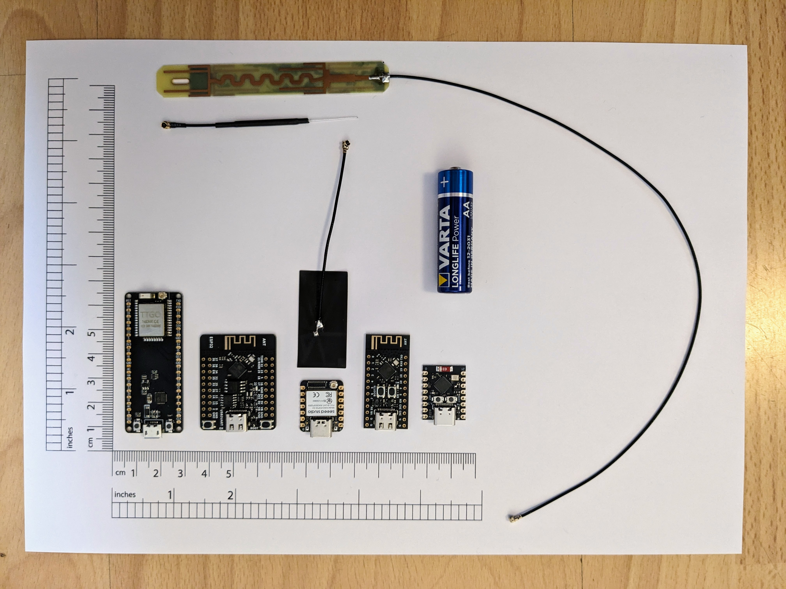

Build
=====

From left to right:

* LILYGO [TTGO ESP32-Micro CH9102](https://www.aliexpress.com/item/32879336509.html) - this is the only one that doesn't use USB-C, it has USB micro-B connector. Much of the dev-board is empty space - most of the electronics are in the small module soldered to the top of the board. The huge antenna at the top is the [8dBi IPEX antenna](https://www.aliexpress.com/item/32847895603.html) designed to go with it.
* WeAct Studio [ESP32-DOWD-V3](https://www.aliexpress.com/item/1005005645111663.html) with onboard PCB antenna.
* Seeed Studio [XIAO ESP32S3](https://www.seeedstudio.com/XIAO-ESP32S3-p-5627.html) with external antenna.
* WeAct Studio [ESP32-C3FH4](https://www.aliexpress.com/item/1005004960064227.html) with onboard PCB antenna.
* Unbranded [Super Mini ESP32-C3](https://www.aliexpress.com/item/1005005757810089.html) with onboard ceramic antenna.

---

I used a small fret saw to cut apart the 3-row pin header - it worked surprisingly well.

I didn't tin the GPS wire ends.

I just yanked out the signal wire when creating the servo cable to deans connectors setup.

The buzzer only sounds if there's battery power - I actually replaced the buzzer, believing it dead, before discovering this.

To use PPM, you have to select it as the RX protocol when flashing Betaflight (it defaults to S.BUS and other more modern protocols).
