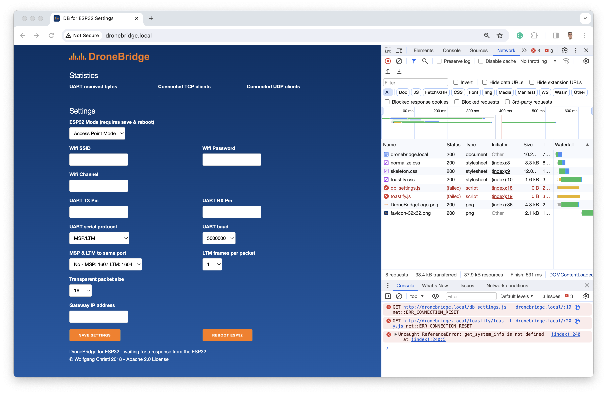

DroneBridge ESP32
=================

I found that my Android Pixel phone could connect to the AP created by the DroneBridge device but couldn't load the device's website.

If I tried <http://dronebridge.local>, it failed with `DNS_PROBE_FINISHED_NXDOMAIN`.

If I tried <http://192.168.2.1>, the loading indicator (at the top of the page) never got beyond almost nothing.

Using my Macbook Air worked much better but the main logo and more importantly one or other of the required Javascript files would typically fail to load.



So, I just inlined the external `.css` and `.js` files into the `index.html` file and converted the logo into a data URI as follows.

First, clone the DroneBridge repo:

```
$ git clone git@github.com:DroneBridge/ESP32.git dronebridge-esp32
$ cd dronebridge-esp32
```

Create a data URI for the logo:

```
$ echo "data:image/png;base64,$(cat frontend/DroneBridgeLogo.png | base64 | tr -d '\r\n')"
data:image/png;base64,iVBORw0KGgoAAAANSUhEUgAAAPoAAAAdCAYAAACDrXEHAAAACXBIWXMAAAV+AAAFfgE+AsMhAAAAGX...
```

Find the line `` in `index.html` and replace the filename `DroneBridgeLogo.png` with the URI generated above:

```
$ vim frontend/index.html
```

You should end up with something like `` where the URI bit is about 5,626 characters long.

And then also inline the `.js` and `.css` files (just inline their content between `<script> ... </script>` and `<style> ... </style>` tags respectively).

I didn't bother inlining `android-icon-192x192.png` and the various sized `favicon` PNGs.

Then determine the IDF version being used and store it as a shell variable:

```
$ grep -F -m 1 esp_idf_version .github/workflows/esp_idf.yml
esp_idf_version: v4.4
$ version=v4.4
```

Now, do a build. Normally, this is do-able without using Docker interactive mode but there's a bug in how the `IDF_VER` value is determined in the Docker image corresponding to the IDF version currently used by the DroneBridge project (it was fixed on Dec 1st, 2023 - see [#12636](https://github.com/espressif/esp-idf/pull/12636)):

```
$ docker run --rm -v $PWD:/project -w /project -u $UID -e HOME=/tmp -it espressif/idf:release-$version
...
> git config --global --add safe.directory /opt/esp/idf
> idf.py set-target esp32 build
> exit
```

Once back out of Docker-land, the results of the build are in the `build` directory.

Unfortunately, it's not trivial (but not impossible) to upload the `.bin` files using Dockerized development environment. An easier solution is to use `pip` to install `esptool`:

```
$ python3 -m venv env
$ source env/bin/activate
$ pip install --upgrade pip
$ pip install esptool
```

Now, the `.bin` files can be uploaded to the development board. Connect the board via USB-C, determine which device it's using (in my case `/dev/ttyUSB0`) and upload:

```
$ device=/dev/ttyUSB0
$ esptool.py \
    -p /dev/ttyUSB0 \
    -b 460800 \
    --before default_reset \
    --after hard_reset \
    --chip esp32 \
    write_flash \
    --flash_mode dio \
    --flash_size detect \
    --flash_freq 40m \
    0x1000 build/bootloader/bootloader.bin \
    0x8000 build/partition_table/partition-table.bin \
    0x10000 build/db_esp32.bin \
    0x110000 build/www.bin
```

Note: there's no need to hold down the BOOT button on the board - everything is done automatically and the board is reset and restarts at the end of the process.

That's it - the board is ready - as noted, I could not successfully connect to it with my Google Pixel phone but could connect to it with my MacBook Air.
